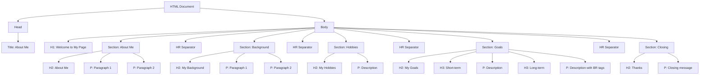

# UI Mockup: Assignment 1 - Hello World

**By Mahendra Bagul**

This is a visual guide for your first webpage! Don't worry about making it look exactly like this - focus on the HTML structure. We'll make things pretty with CSS later!

---

## 🎨 Desktop View (Simple Text Layout)

```
┌─────────────────────────────────────────────────────────────┐
│  Browser Tab: "About Me - Your Name"                        │
├─────────────────────────────────────────────────────────────┤
│                                                              │
│                                                              │
│                    Welcome to My Page!                       │
│                                                              │
│                                                              │
│  About Me                                                    │
│  ────────                                                    │
│                                                              │
│  Hi! My name is John Doe and I'm learning web development.  │
│  This is my very first webpage, and I'm excited to be on    │
│  this journey!                                               │
│                                                              │
│  I live in Mumbai, India and I'm passionate about learning  │
│  new things. Web development has always fascinated me, and   │
│  now I'm finally taking the first step to make it happen.   │
│                                                              │
│  ──────────────────────────────────────────────────────────│
│                                                              │
│  My Background                                               │
│  ─────────────                                               │
│                                                              │
│  I recently graduated with a degree in Computer Science...  │
│                                                              │
│  ──────────────────────────────────────────────────────────│
│                                                              │
│  My Hobbies                                                  │
│  ──────────                                                  │
│                                                              │
│  In my free time, I enjoy reading tech blogs...             │
│                                                              │
│  ──────────────────────────────────────────────────────────│
│                                                              │
│  My Goals                                                    │
│  ────────                                                    │
│                                                              │
│      Short-term Goals                                        │
│      ────────────────                                        │
│                                                              │
│      Right now, I'm focused on mastering HTML basics...     │
│                                                              │
│      Long-term Goals                                         │
│      ───────────────                                         │
│                                                              │
│      My dream is to become a professional full-stack...     │
│                                                              │
│  ──────────────────────────────────────────────────────────│
│                                                              │
│  Thanks for Visiting!                                        │
│  ────────────────────                                        │
│                                                              │
│  This is just the beginning of my web development journey.  │
│  Stay tuned for more amazing projects!                       │
│                                                              │
└─────────────────────────────────────────────────────────────┘
```

---

## 📐 Component Hierarchy (Mermaid Diagram)



---

## 🎯 HTML Structure Map

### Document Structure
```html
<!DOCTYPE html>
<html>
  └── <head>
       └── <title>About Me - Your Name</title>
  └── <body>
       ├── <h1>Main Heading</h1>
       ├── <h2>Section 1 Title</h2>
       ├── <p>Paragraph</p>
       ├── <p>Paragraph</p>
       ├── <hr>
       ├── <h2>Section 2 Title</h2>
       ├── <p>Paragraph</p>
       ├── <hr>
       ├── <h2>Section 3 Title</h2>
       │   ├── <h3>Subsection</h3>
       │   ├── <p>Paragraph</p>
       │   ├── <h3>Subsection</h3>
       │   └── <p>Paragraph with <br> breaks</p>
       ├── <hr>
       └── <h2>Closing Section</h2>
           └── <p>Final paragraph</p>
```

---

## 📱 What It Looks Like in Browser

### Without CSS (Plain HTML - What You'll Create)

Your page will look very simple - just black text on white background. That's perfect! Here's what you'll see:

**Big heading at the top** (h1)  
Subheading for section (h2)  
Regular paragraph text that wraps nicely...

────────────────────────────  ← Horizontal line (hr)

**Another subheading** (h2)  
More paragraph text...

---

## 🎨 Element Specifications

### Browser Tab
- **Title**: "About Me - [Your Name]"
- Shows in the browser tab/window title

### Headings Hierarchy
```
H1 (Main Page Title)
├── H2 (Section: About Me)
├── H2 (Section: Background)
├── H2 (Section: Hobbies)
├── H2 (Section: Goals)
│   ├── H3 (Subsection: Short-term)
│   └── H3 (Subsection: Long-term)
└── H2 (Section: Thanks)
```

### Content Sections

| Section | Elements | Description |
|---------|----------|-------------|
| Header | 1 × H1 | Main page title |
| About Me | H2 + 2 × P | Introduction paragraphs |
| Background | H2 + 2 × P | Your background info |
| Hobbies | H2 + 1 × P | What you enjoy |
| Goals | H2 + 2 × H3 + 2 × P | Short and long-term goals |
| Closing | H2 + 1 × P | Thank you message |

### Separators
- **Horizontal Rules (HR)**: 4 used between major sections
- **Line Breaks (BR)**: Used within paragraphs for formatting

---

## 💡 Visual Notes

### What You'll See (Browser Default Styles)
- **H1**: Very large text
- **H2**: Large text (smaller than H1)
- **H3**: Medium text (smaller than H2)
- **P**: Normal text with space above and below
- **HR**: Gray horizontal line across the page
- **BR**: Forces text to next line (no extra space)

### Default Browser Spacing
```
H1 has large margins (space above/below)
    ↓
Paragraph has medium margins
    ↓
HR creates a visible divider line
    ↓
Paragraph has medium margins
```

---

## 🎯 Focus Areas for This Assignment

Since this is your first assignment, focus on:

1. ✅ **Correct HTML structure** - proper DOCTYPE, html, head, body
2. ✅ **Using different heading levels** - h1, h2, h3 appropriately  
3. ✅ **Writing meaningful content** - make it about YOU
4. ✅ **Using separators** - hr and br tags
5. ✅ **Adding comments** - explain what each section does

**Don't worry about**:
- ❌ Colors, fonts, or styling (that's CSS - coming soon!)
- ❌ Making it look "pretty" (focus on structure)
- ❌ Images or links (those are in later assignments)

---

## 📸 Expected Output

When you open your `index.html` in a browser:

1. **Browser tab shows your title** (not just "index.html")
2. **Big heading at the top** that stands out
3. **Well-organized sections** with clear headings
4. **Horizontal lines** separating major sections
5. **Multiple paragraphs** with readable content
6. **Nested headings** showing hierarchy (h2 under h1, h3 under h2)

---

## ✅ Checklist

Your webpage should have:

- [ ] Page title visible in browser tab
- [ ] One h1 heading (largest)
- [ ] Multiple h2 headings (section titles)
- [ ] At least one h3 heading (subsection)
- [ ] 5+ paragraphs with real content
- [ ] 3+ horizontal rules (hr) separating sections
- [ ] At least one line break (br) within a paragraph
- [ ] HTML comments explaining sections
- [ ] Proper indentation making code readable

---

## 🚀 Next Steps

After completing this assignment:
- **View your page** in different browsers (Chrome, Firefox, Safari)
- **Try refreshing** after making changes
- **Experiment** with more headings and paragraphs
- **Move to Assignment 2** to learn text formatting!

---

Remember: This is just structure! We'll make it beautiful with CSS in Phase 2. For now, master the HTML basics! 🎯

