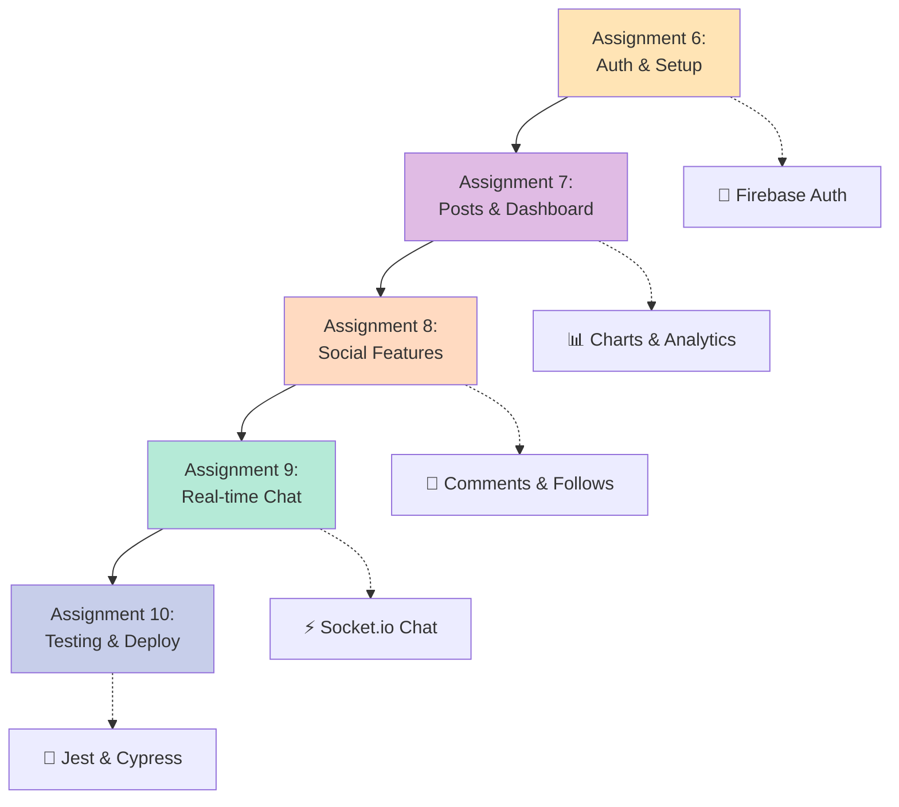

# 🚀 React.js Complete Learning Course
### *From Beginner to Production-Ready Developer*

<div align="center">


**A comprehensive, project-based React.js course with 10 progressive assignments**

**📝 Created by:** [Mahendra Bagul](https://github.com/bagulm123)  
**📅 Version 1.0** | October 2025

[🎯 Get Started](#-quick-start) • [📚 Assignments](#-course-roadmap) • [🎨 UI Mockups](./resources/UI_MOCKUPS_INDEX.md) • [👨‍🏫 For Instructors](../for-instructors/)

</div>

---

## 📊 Course Statistics

| Metric | Value |
|--------|-------|
| 📝 **Total Assignments** | 11 Progressive Projects |
| ⏱️ **Estimated Duration** | 130-160 hours (23 weeks) |
| 🎓 **Skill Level** | Beginner → Advanced → Expert |
| 🛠️ **Tech Stack** | 15+ Modern Libraries |
| 🎨 **UI Mockups** | Complete Visual Guides |
| 📖 **Documentation** | 30+ Detailed Guides |
| 🚀 **Deployable Projects** | All 11 Assignments |

---

## 👋 Welcome, Future React Developer!

Hey there! I'm Mahendra, and I've created this course to help freshers like you master React.js through real-world projects. No boring theory – we're building actual applications you can show to recruiters!

I've been in your shoes, staring at React docs wondering "where do I even start?" That's why this course takes you from "What's JSX?" to "I just built a production-ready social media platform!" step by step.

Ready to dive in? Let's go! 🚀

---

## 🎯 Quick Start

<div align="center">

### 🌟 **New Student? Start Here!**

📖 **[GET_STARTED_HERE.md](../GET_STARTED_HERE.md)** ← Your complete onboarding guide

</div>

### ⚡ Fast Setup

```bash
# 1. Check prerequisites
node --version  # Need 18+
npm --version

# 2. Navigate to first assignment
cd assignment-01-portfolio

# 3. Create your project
npm create vite@latest . -- --template react
npm install
npm run dev

# 4. Open http://localhost:5173
```

---

## 🗺️ Course Roadmap

```mermaid
graph LR
    A[Start] --> B[Phase 1: Foundation]
    B --> C[Assignment 1:<br/>Portfolio]
    C --> D[Assignment 2:<br/>Weather API]
    D --> E[Assignment 3:<br/>Task Manager]
    E --> F[Assignment 4:<br/>E-Commerce]
    F --> G[Assignment 5:<br/>Movie Explorer]
    G --> H[Phase 2: Production App]
    H --> I[Assignments 6-10:<br/>ConnectHub]
    I --> J[🎓 React Developer!]
    
    style A fill:#e1f5ff
    style B fill:#ffe1e1
    style H fill:#ffe1e1
    style J fill:#90EE90
```



---

## 📚 Phase 1: Foundation Projects (Weeks 1-10)

### 🎨 Assignment 1: Personal Portfolio Website
`⏱️ 8-10 hours` • `⭐⭐☆☆☆ Beginner`

<details>
<summary><b>Click to expand details</b></summary>

**What You'll Learn:**
- ⚛️ React fundamentals (components, props, state)
- 🧭 React Router for navigation
- 📱 Responsive design with CSS Modules
- 📝 Form validation
- 🎨 Component composition

**Tech Stack:**  
`React` • `Vite` • `React Router` • `CSS Modules` • `React Icons`

**Features You'll Build:**
- ✅ Responsive navbar with mobile menu
- ✅ Hero section with smooth scrolling
- ✅ Projects showcase grid
- ✅ Contact form with validation
- ✅ Multi-page routing

**Resources:**
- 📖 [Assignment Guide](./assignment-01-portfolio/ASSIGNMENT_1_GUIDE.md)
- 🎨 [UI Mockup](./assignment-01-portfolio/UI_MOCKUP.md)

</details>

---

### 🌦️ Assignment 2: Weather Dashboard
`⏱️ 10-12 hours` • `⭐⭐⭐☆☆ Intermediate`

<details>
<summary><b>Click to expand details</b></summary>

**What You'll Learn:**
- 🔌 API integration with Axios
- ⚡ useEffect hook and side effects
- 🎣 Custom hooks creation
- 🔐 Environment variables
- 💾 LocalStorage for persistence
- ⏳ Loading and error states

**Tech Stack:**  
`React` • `Axios` • `Bootstrap 5` • `OpenWeatherMap API`

**Features You'll Build:**
- ✅ City search with API
- ✅ Current weather display
- ✅ 5-day forecast
- ✅ Search history (LocalStorage)
- ✅ Error handling
- ✅ Responsive Bootstrap UI

**Prerequisites:**
- 🔑 [OpenWeatherMap API key](./resources/API_KEYS_AND_SERVICES.md) (free)

**Resources:**
- 📖 [Assignment Guide](./assignment-02-weather-dashboard/ASSIGNMENT_2_GUIDE.md)
- 🎨 [UI Mockup](./assignment-02-weather-dashboard/UI_MOCKUP.md)

</details>

---

### ✅ Assignment 3: Task Management App
`⏱️ 12-15 hours` • `⭐⭐⭐⭐☆ Advanced`

<details>
<summary><b>Click to expand details</b></summary>

**What You'll Learn:**
- 🎨 Material-UI component library
- 🎭 Theme customization (dark/light mode)
- 🔄 Context API for global state
- 📝 Complex CRUD operations
- 📅 Date handling with date-fns
- 💾 LocalStorage persistence

**Tech Stack:**  
`React` • `Material-UI v5` • `date-fns` • `LocalStorage`

**Features You'll Build:**
- ✅ Create, edit, delete tasks
- ✅ Task categories and priorities
- ✅ Date picker for due dates
- ✅ Filtering and sorting
- ✅ Dark/light theme toggle
- ✅ Snackbar notifications

**Resources:**
- 📖 [Assignment Guide](./assignment-03-task-manager/ASSIGNMENT_3_GUIDE.md)
- 🎨 [UI Mockup](./assignment-03-task-manager/UI_MOCKUP.md)

</details>

---

### 🛒 Assignment 4: E-Commerce Product Catalog
`⏱️ 15-18 hours` • `⭐⭐⭐⭐⭐ Advanced`

<details>
<summary><b>Click to expand details</b></summary>

**What You'll Learn:**
- 🔴 Redux Toolkit state management
- 💾 Redux Persist for cart
- 🔄 Async thunks for API calls
- 🎯 Selectors and memoization
- 📊 Normalized state patterns
- 🛠️ Redux DevTools

**Tech Stack:**  
`React` • `Redux Toolkit` • `Redux Persist` • `React Router` • `FakeStore API`

**Features You'll Build:**
- ✅ Product listing with API
- ✅ Advanced filtering and sorting
- ✅ Shopping cart with Redux
- ✅ Cart persistence
- ✅ Product details page
- ✅ Cart drawer with animations

**Resources:**
- 📖 [Assignment Guide](./assignment-04-ecommerce/ASSIGNMENT_4_GUIDE.md)
- 🎨 [UI Mockup](./assignment-04-ecommerce/UI_MOCKUP.md)

</details>

---

### 🎬 Assignment 5: Movie Database Explorer
`⏱️ 18-20 hours` • `⭐⭐⭐⭐⭐ Expert`

<details>
<summary><b>Click to expand details</b></summary>

**What You'll Learn:**
- 🎨 Tailwind CSS utility-first approach
- ✨ Framer Motion animations
- ♾️ Infinite scroll implementation
- ⚡ Debouncing and performance
- 👁️ Intersection Observer API
- 🖼️ Lazy loading images
- 🚀 Performance optimization (memo, useMemo, useCallback)

**Tech Stack:**  
`React` • `Tailwind CSS` • `Framer Motion` • `TMDB API` • `React Router`

**Features You'll Build:**
- ✅ Movie search with debouncing
- ✅ Infinite scroll pagination
- ✅ Smooth page animations
- ✅ Movie details with cast/videos
- ✅ Favorites system
- ✅ Loading skeletons
- ✅ Lazy image loading

**Prerequisites:**
- 🔑 [TMDB API key](./resources/API_KEYS_AND_SERVICES.md) (free)

**Resources:**
- 📖 [Assignment Guide](./assignment-05-movie-explorer/ASSIGNMENT_5_GUIDE.md)
- 🎨 [UI Mockup](./assignment-05-movie-explorer/UI_MOCKUP.md)

</details>

---

## 🏗️ Phase 2: Production App (Weeks 11-20)

### 🌐 ConnectHub: Social Media Dashboard
`⏱️ 60-80 hours total` • `⭐⭐⭐⭐⭐ Production Level`

**One comprehensive application built across 5 assignments**



<details>
<summary><b>🔐 Assignment 6: Foundation & Authentication (10-12 hours)</b></summary>

**What You'll Build:**
- TypeScript project setup
- Firebase Authentication (email, Google OAuth)
- Protected routes
- User profiles with edit capability
- Theme system (dark/light)

**Tech Stack:**  
`React` • `TypeScript` • `Firebase Auth` • `Material-UI` • `Redux Toolkit`

</details>

<details>
<summary><b>📊 Assignment 7: Dashboard & Posts (12-15 hours)</b></summary>

**What You'll Build:**
- Post creation (text, images, videos)
- CRUD operations for posts
- Like and save functionality
- Feed with pagination
- Dashboard with Chart.js analytics

**Tech Stack:**  
`Firestore` • `Firebase Storage` • `Chart.js` • `react-chartjs-2`

</details>

<details>
<summary><b>💬 Assignment 8: Social Interactions (12-15 hours)</b></summary>

**What You'll Build:**
- Comments system (nested)
- User profiles (view others)
- Follow/unfollow system
- Notifications center
- Activity feed

**Tech Stack:**  
`Firestore Subcollections` • `Real-time Listeners`

</details>

<details>
<summary><b>⚡ Assignment 9: Real-time Features (12-15 hours)</b></summary>

**What You'll Build:**
- Real-time chat with Socket.io
- Online status tracking
- Typing indicators
- Advanced search with filters
- Explore page with trending

**Tech Stack:**  
`Socket.io` • `Node.js Server` • `WebSockets`

</details>

<details>
<summary><b>🧪 Assignment 10: Testing & Production (12-15 hours)</b></summary>

**What You'll Build:**
- Unit tests with Jest
- Component tests with React Testing Library
- Integration tests
- CI/CD with GitHub Actions
- Production deployment
- Performance optimization

**Tech Stack:**  
`Jest` • `React Testing Library` • `Cypress` • `GitHub Actions` • `Vercel`

</details>

**📖 [View Complete ConnectHub Guide](./assignment-06-10-comprehensive-app/README.md)**

---

### ⚡ Phase 3: Performance Mastery (Bonus/Capstone)

<details>
<summary><b>🚀 Assignment 11: Performance Profiling & Optimization (10-15 hours)</b></summary>

**What You'll Build:**
- Performance monitoring dashboard
- Real-time Web Vitals tracking
- Bundle size analysis visualization
- Before/after optimization comparisons
- Optimization checklist tracker

**What You'll Learn:**
- React DevTools Profiler
- Chrome Performance tools
- Lighthouse audits
- Bundle optimization
- React.memo, useMemo, useCallback
- Code splitting & lazy loading
- Image optimization
- Core Web Vitals (LCP, FID, CLS)

**Tech Stack:**  
`React DevTools` • `web-vitals` • `Chart.js` • `Lighthouse` • `Bundle Analyzer`

**📖 [View Assignment 11 Guide](./assignment-11-performance-optimization/ASSIGNMENT_11_GUIDE.md)**

</details>

---

## 🛠️ Tech Stack Overview

### Core Technologies
<div align="center">


</div>

### Libraries by Assignment

| Library | Used In | Purpose |
|---------|---------|---------|
| 🧭 React Router v6 | 1, 2, 4, 5, 6-10 | Navigation & routing |
| 🔌 Axios | 2, 4, 5 | HTTP requests |
| 🎨 Bootstrap 5 | 2, 4 | UI framework |
| 🎭 Material-UI | 3, 6-10 | Component library |
| 💨 Tailwind CSS | 5 | Utility-first CSS |
| 🔴 Redux Toolkit | 4, 6-10 | State management |
| ✨ Framer Motion | 5, 6-10 | Animations |
| 🔥 Firebase | 6-10 | Auth, Database, Storage |
| 📊 Chart.js | 7 | Data visualization |
| ⚡ Socket.io | 9 | Real-time communication |
| 🧪 Jest & RTL | 10 | Testing |

---

## 📖 Essential Documentation

<table>
<tr>
<td width="50%">

### 🎓 For Students

- 🌟 **[GET_STARTED_HERE.md](../GET_STARTED_HERE.md)**  
  *Complete onboarding guide*

- ⚡ **[QUICK_START.md](../QUICK_START.md)**  
  *Setup & commands reference*

- 📁 **[FOLDER_STRUCTURE.md](../FOLDER_STRUCTURE.md)**  
  *Navigate the course*

- 🎨 **[UI Mockups Index](./resources/UI_MOCKUPS_INDEX.md)**  
  *Visual guides for all assignments*

- 🔑 **[API Keys Guide](./resources/API_KEYS_AND_SERVICES.md)**  
  *Get your API keys*

- 🎨 **[Common Patterns](../resources/COMMON_PATTERNS.md)**  
  *Reusable code patterns*

- 🚀 **[Deployment Guide](../deployment-configs/DEPLOYMENT_GUIDE.md)**  
  *Deploy to production*

- 📝 **[Learning Tracker](../notes/LEARNING_TRACKER.md)**  
  *Track your progress*

</td>
<td width="50%">

### 👨‍🏫 For Instructors

- 📘 **[Instructor Guide](../for-instructors/INSTRUCTOR_GUIDE.md)**  
  *Complete teaching guide*

- 💡 **[Solution Guidelines](../for-instructors/SOLUTION_GUIDELINES.md)**  
  *How to guide students*

- 📋 **[Assessment Rubrics](../for-instructors/README.md#-grading-rubrics)**  
  *Grading criteria*

- 📊 **[Progress Tracking](../for-instructors/README.md#-tracking-student-progress)**  
  *Monitor student success*

</td>
</tr>
</table>

---

## 🎯 Learning Outcomes

By completing this course, you will:

<table>
<tr>
<td width="50%">

### 💻 Technical Skills

✅ Build production-ready React apps  
✅ Master React 18 features & hooks  
✅ Implement complex state management  
✅ Integrate RESTful APIs  
✅ Handle authentication & authorization  
✅ Build real-time features  
✅ Write comprehensive tests  
✅ Optimize app performance  
✅ Deploy to production  
✅ Set up CI/CD pipelines  

</td>
<td width="50%">

### 🚀 Professional Skills

✅ Project planning & execution  
✅ Component-based architecture  
✅ Code organization at scale  
✅ Git workflow & version control  
✅ Debugging techniques  
✅ Performance optimization  
✅ UI/UX best practices  
✅ Documentation writing  
✅ Problem-solving mindset  
✅ Portfolio-ready projects  

</td>
</tr>
</table>

---

## ✅ Code Quality Standards

Before completing each assignment, ensure your code meets these standards:

<table>
<tr>
<td width="33%">

### 🏗️ Architecture
- ✅ Functional components
- ✅ Custom hooks
- ✅ Reusable components
- ✅ Logical file organization
- ✅ Separation of concerns

</td>
<td width="33%">

### 💎 Code Quality
- ✅ Clean, readable code
- ✅ Meaningful names
- ✅ DRY principle
- ✅ No console.logs
- ✅ Proper error handling

</td>
<td width="33%">

### 🎨 UI/UX
- ✅ Responsive design
- ✅ Loading states
- ✅ Error messages
- ✅ Accessibility (a11y)
- ✅ Smooth animations

</td>
</tr>
</table>

---

## 💡 Best Practices

### Component Organization Pattern

```javascript
// 1. Imports
import React, { useState, useEffect } from 'react';
import PropTypes from 'prop-types';
import styles from './Component.module.css';

// 2. Constants
const API_URL = 'https://api.example.com';

// 3. Component
const MyComponent = ({ prop1, prop2 }) => {
  // 4. State
  const [state, setState] = useState('');
  
  // 5. Effects
  useEffect(() => {
    // Side effects
  }, []);
  
  // 6. Handlers
  const handleClick = () => {
    // Event handling
  };
  
  // 7. Render
  return (
    <div className={styles.container}>
      {/* JSX */}
    </div>
  );
};

// 8. PropTypes
MyComponent.propTypes = {
  prop1: PropTypes.string.isRequired,
  prop2: PropTypes.number,
};

// 9. Export
export default MyComponent;
```

---

## 🤔 FAQ

<details>
<summary><b>Q: Do I need prior React experience?</b></summary>

No! This course starts from the basics. However, you should know:
- JavaScript (ES6+)
- HTML & CSS
- Basic command line usage

</details>

<details>
<summary><b>Q: What if I get stuck?</b></summary>

Each assignment has:
- Detailed step-by-step guides
- Common challenges section
- UI mockups for visual reference
- Code pattern examples

Also check:
- Assignment-specific troubleshooting
- React documentation
- Stack Overflow
- React communities

</details>

<details>
<summary><b>Q: Can I use this for my portfolio?</b></summary>

Absolutely! All 10 projects are portfolio-ready. Deploy them and add to your resume!

</details>

<details>
<summary><b>Q: How long does it take to complete?</b></summary>

- **Intensive (full-time)**: 10 weeks
- **Part-time**: 20 weeks  
- **Self-paced**: 3-6 months

Average: 6-8 hours per assignment for foundations, 12-15 hours for advanced.

</details>

<details>
<summary><b>Q: Do I need to pay for anything?</b></summary>

No! Everything is free:
- All course materials
- React & libraries (open source)
- API keys (free tiers)
- Deployment (free hosting options)

</details>

---

## 🎯 Success Checklist

Track your progress through the course:

- [ ] 📖 Read [GET_STARTED_HERE.md](../GET_STARTED_HERE.md)
- [ ] ✅ Prerequisites installed (Node.js, Git)
- [ ] 🎨 Reviewed UI mockups
- [ ] 🔐 Got necessary API keys
- [ ] 1️⃣ Assignment 1: Portfolio completed & deployed
- [ ] 2️⃣ Assignment 2: Weather Dashboard completed & deployed
- [ ] 3️⃣ Assignment 3: Task Manager completed & deployed
- [ ] 4️⃣ Assignment 4: E-Commerce completed & deployed
- [ ] 5️⃣ Assignment 5: Movie Explorer completed & deployed
- [ ] 6️⃣ Assignment 6: Auth & Setup completed
- [ ] 7️⃣ Assignment 7: Posts & Dashboard completed
- [ ] 8️⃣ Assignment 8: Social Features completed
- [ ] 9️⃣ Assignment 9: Real-time Chat completed
- [ ] 🔟 Assignment 10: Testing & deployed to production
- [ ] ⚡ Assignment 11: Performance optimization (Bonus)
- [ ] 🎓 Portfolio website updated with all projects
- [ ] 🌟 Shared projects on LinkedIn/GitHub

---

## 🌟 What Students Will Build

<div align="center">

### Phase 1: Foundation Projects (Assignments 1-5)

<table>
<tr>
<td align="center" width="20%">
<h3>💼</h3>
<b>Portfolio Website</b><br/>
<sub>React Basics • Components • Routing</sub>
</td>
<td align="center" width="20%">
<h3>🌦️</h3>
<b>Weather Dashboard</b><br/>
<sub>API Integration • Axios • Bootstrap</sub>
</td>
<td align="center" width="20%">
<h3>✅</h3>
<b>Task Manager</b><br/>
<sub>Material-UI • State • LocalStorage</sub>
</td>
<td align="center" width="20%">
<h3>🛒</h3>
<b>E-Commerce</b><br/>
<sub>Redux Toolkit • Cart • Filters</sub>
</td>
<td align="center" width="20%">
<h3>🎬</h3>
<b>Movie Explorer</b><br/>
<sub>Advanced Patterns • Tailwind • Animations</sub>
</td>
</tr>
</table>

### Phase 2: Production Application (Assignments 6-10)

<table>
<tr>
<td align="center" colspan="5">
<h2>🌐 ConnectHub Social Platform</h2>
<b>Full-Stack Production-Ready Application</b><br/>
<sub>Firebase • TypeScript • Real-time Chat • Testing • Deployment</sub><br/>
<sub>⭐⭐⭐⭐⭐ Complete Social Media Platform</sub>
</td>
</tr>
</table>

### Phase 3: Performance Mastery (Bonus)

<table>
<tr>
<td align="center">
<h3>⚡</h3>
<b>Performance Optimization</b><br/>
<sub>Profiling • Web Vitals • Bundle Analysis • Optimization</sub>
</td>
</tr>
</table>

</div>

---

## 📞 Support & Community

### 💬 Getting Help

**When stuck, try these steps:**

1. 🔍 **Re-read the assignment guide** - Often the solution is there
2. 🎨 **Check the UI mockup** - Ensure you're building the right thing
3. 📖 **Review code patterns** - [COMMON_PATTERNS.md](../resources/COMMON_PATTERNS.md)
4. 🔧 **Check troubleshooting** - Each guide has common issues
5. 🌐 **Google the error** - Most errors are documented
6. 💡 **Ask the community** - React Discord, Stack Overflow

### 🌐 Useful Communities

- [Reactiflux Discord](https://discord.gg/react)
- [React subreddit](https://reddit.com/r/reactjs)
- [Stack Overflow - React Tag](https://stackoverflow.com/questions/tagged/reactjs)
- [Dev.to React Community](https://dev.to/t/react)

---

## 👨‍🏫 For Instructors & Mentors

Teaching this course? We've got you covered!

**📁 [`for-instructors/`](./for-instructors/) folder includes:**

- 📘 Complete teaching guide
- 📊 Assessment rubrics  
- 💡 Solution guidelines
- 📋 Progress tracking templates
- 🎯 Teaching tips & strategies
- 🐛 Common student challenges
- ⏰ Suggested schedules (10/20 week formats)

---

## 🤝 Contributing

Found an error? Have a suggestion? Contributions welcome!

**How to contribute:**
1. 🐛 Report issues
2. 💡 Suggest improvements
3. 📖 Fix documentation
4. ✨ Share your completed projects

---

## 📄 License

This course is free for educational purposes.

**You can:**
- ✅ Use for learning
- ✅ Share with students
- ✅ Adapt for your institution
- ✅ Build portfolio projects

---

## 🎉 Ready to Start?

<div align="center">

### 👉 **[BEGIN YOUR JOURNEY](./GET_STARTED_HERE.md)** 👈

Transform from a React beginner to a production-ready developer in 20 weeks!

---

### 🌟 Star this repo if you find it helpful!

**Share with friends learning React** • **Follow for updates** • **Happy Coding!**

---


</div>

---

<div align="center">

### 💬 A Final Word

I built this course because I genuinely want to see you succeed. When you complete all assignments and deploy your optimized projects, send me the link – I'd love to see what you've built!

Remember: every expert was once a beginner who refused to give up. You've got this! 💪

**- Mahendra Bagul**

---

**📅 Last Updated:** October 21, 2025  
**⏱️ Course Duration:** 20 weeks  
**🎯 Target:** IT Freshers & Self-Learners  
**✅ Status:** Ready for Students!

**© 2025 Mahendra Bagul** • Made with ❤️, ☕, and late nights  
*Free for educational use • Please credit if shared*

</div>
