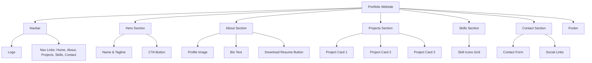
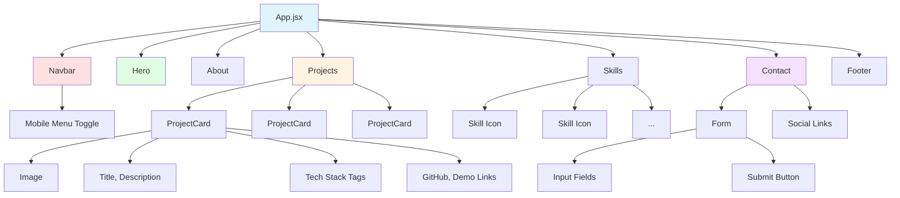
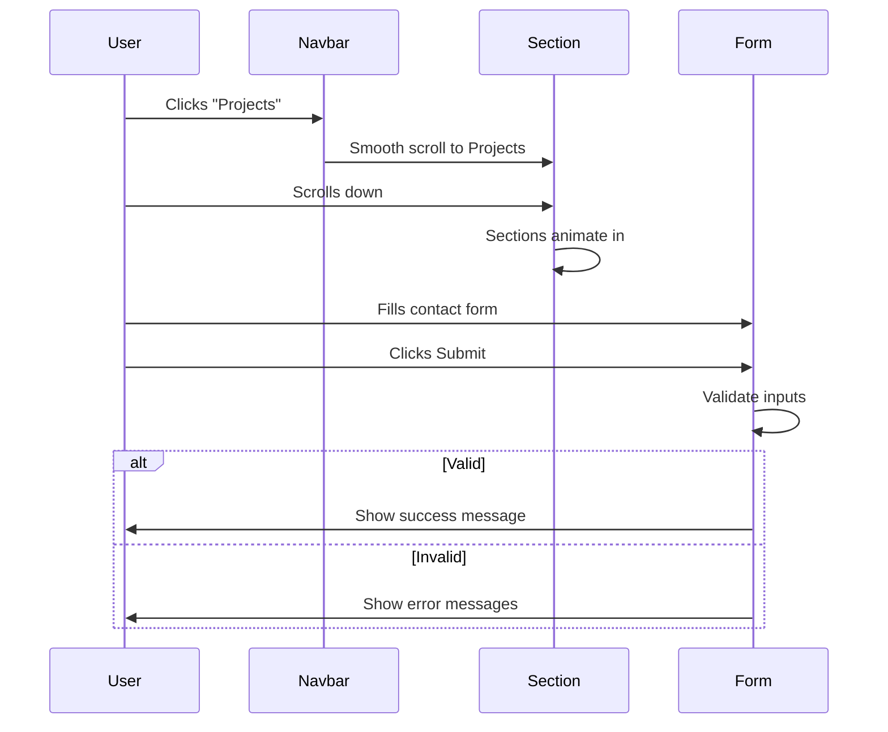
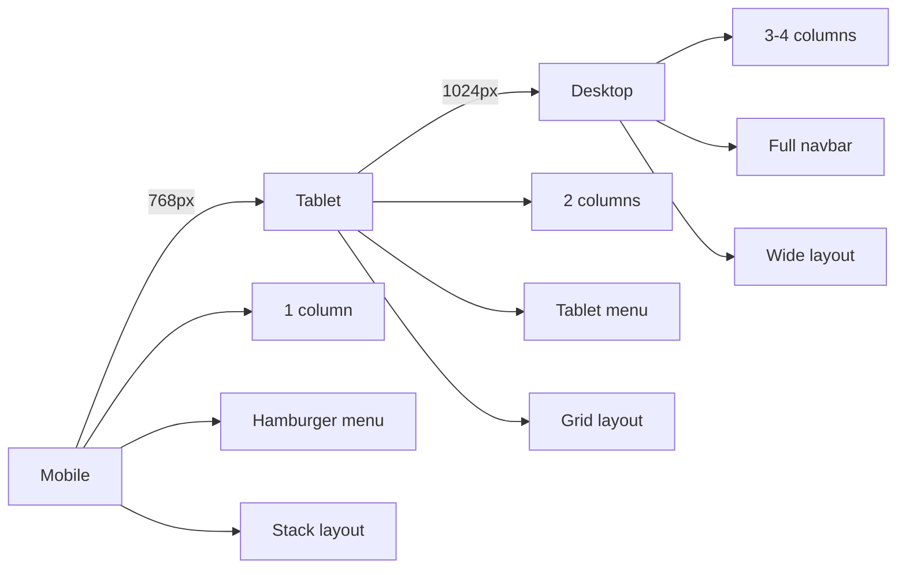

# 🎨 Assignment 1: Portfolio Website - UI Mockup

Visual guide showing what you'll build for your personal portfolio website.

---

## 📱 Desktop Layout



---

## 🎨 Page Layout Wireframe

```
┌─────────────────────────────────────────────────┐
│  [LOGO]              Home About Projects Skills  │  ← Navbar (Fixed)
└─────────────────────────────────────────────────┘

┌─────────────────────────────────────────────────┐
│                                                 │
│            Hi, I'm [Your Name]                  │
│         Full Stack React Developer              │  ← Hero Section
│                                                 │
│            [View My Work ↓]                     │
│                                                 │
└─────────────────────────────────────────────────┘

┌─────────────────────────────────────────────────┐
│  About Me                                       │
│  ┌─────┐                                        │
│  │ 📷  │  Lorem ipsum dolor sit amet...         │  ← About Section
│  │ IMG │  consectetur adipiscing elit...        │
│  └─────┘  [Download Resume]                     │
└─────────────────────────────────────────────────┘

┌─────────────────────────────────────────────────┐
│  My Projects                                    │
│                                                 │
│  ┌──────┐  ┌──────┐  ┌──────┐                  │
│  │ 📷   │  │ 📷   │  │ 📷   │                  │  ← Projects Grid
│  │ IMG  │  │ IMG  │  │ IMG  │                  │
│  │Title │  │Title │  │Title │                  │
│  │Desc  │  │Desc  │  │Desc  │                  │
│  │Tech  │  │Tech  │  │Tech  │                  │
│  │Links │  │Links │  │Links │                  │
│  └──────┘  └──────┘  └──────┘                  │
└─────────────────────────────────────────────────┘

┌─────────────────────────────────────────────────┐
│  Skills                                         │
│                                                 │
│  ⚛️  💻  🎨  📱  🗄️  ⚙️                         │  ← Skills Icons
│  React  JS  CSS  HTML  Git  Node               │
└─────────────────────────────────────────────────┘

┌─────────────────────────────────────────────────┐
│  Contact Me                                     │
│                                                 │
│  Name:    [____________]                        │
│  Email:   [____________]                        │  ← Contact Form
│  Message: [____________]                        │
│           [____________]                        │
│  [Submit]  [🔗 LinkedIn] [🔗 GitHub]           │
└─────────────────────────────────────────────────┘

┌─────────────────────────────────────────────────┐
│  © 2025 Your Name | [Social Links]             │  ← Footer
└─────────────────────────────────────────────────┘
```

---

## 📱 Mobile Layout

```
┌──────────────┐
│ [LOGO]  [☰] │  ← Navbar with Hamburger
└──────────────┘

┌──────────────┐
│              │
│  Hi, I'm     │
│  [Name]      │  ← Hero (Stacked)
│              │
│ [View Work]  │
└──────────────┘

┌──────────────┐
│  About Me    │
│  ┌────────┐  │
│  │  📷    │  │  ← Profile Image
│  └────────┘  │
│  Bio text... │
│ [Resume]     │
└──────────────┘

┌──────────────┐
│  Projects    │
│  ┌────────┐  │
│  │  📷    │  │
│  │ Title  │  │  ← Projects (Vertical Stack)
│  │ Desc   │  │
│  └────────┘  │
│  ┌────────┐  │
│  │  📷    │  │
│  └────────┘  │
└──────────────┘

┌──────────────┐
│  Skills      │
│  ⚛️  💻  🎨  │  ← Skills Grid (2 cols)
│  📱  🗄️  ⚙️  │
└──────────────┘

┌──────────────┐
│  Contact     │
│  [Name]      │
│  [Email]     │  ← Form (Full Width)
│  [Message]   │
│  [Submit]    │
│  [Socials]   │
└──────────────┘
```

---

## 🧩 Component Hierarchy



---

## 🎯 User Interactions



---

## 🎨 Key Features to Implement

### Desktop Navigation
```
[Logo]                    Home  About  Projects  Skills  Contact
```

### Mobile Navigation (Hamburger Menu)
```
[Logo]  [☰]

When clicked:
┌─────────────┐
│ Home        │
│ About       │
│ Projects    │
│ Skills      │
│ Contact     │
│ [X] Close   │
└─────────────┘
```

### Project Card
```
┌──────────────────┐
│  ┌────────────┐  │
│  │   Image    │  │
│  └────────────┘  │
│                  │
│  Project Title   │
│  Description...  │
│                  │
│  React  CSS  JS  │  ← Tech stack badges
│                  │
│  [GitHub] [Demo] │
└──────────────────┘

Hover Effect:
- Card lifts up (transform: translateY(-5px))
- Shadow increases
- Image slightly zooms
```

### Contact Form States
```
Initial:
[Name_____]
[Email____]
[Message__]
[Submit]

Typing:
[Name_____] ← Blue border when focused
[Email____]
[Message__]
[Submit]

Error:
[Name_____]
[Email____] ← Red border
  ⚠️ Invalid email
[Message__]
[Submit]

Success:
✅ Message sent successfully!
```

---

## 🎨 Color Scheme Suggestions

### Option 1: Modern Blue
```
Primary:   #3B82F6 (Blue)
Secondary: #1E40AF (Dark Blue)
Accent:    #F59E0B (Orange)
Background:#F9FAFB (Light Gray)
Text:      #1F2937 (Dark Gray)
```

### Option 2: Dark Theme
```
Primary:   #10B981 (Green)
Secondary: #059669 (Dark Green)
Background:#1F2937 (Dark Gray)
Surface:   #374151 (Medium Gray)
Text:      #F9FAFB (White)
```

### Option 3: Minimal
```
Primary:   #000000 (Black)
Secondary: #4B5563 (Gray)
Accent:    #EF4444 (Red)
Background:#FFFFFF (White)
Text:      #111827 (Near Black)
```

---

## 📐 Responsive Breakpoints



---

## ✅ UI Checklist

- [ ] Responsive navbar (desktop & mobile)
- [ ] Hamburger menu animation
- [ ] Hero section with gradient/image background
- [ ] Profile image with hover effect
- [ ] Project cards in responsive grid
- [ ] Hover effects on cards
- [ ] Tech stack badges/tags
- [ ] Skill icons in grid
- [ ] Contact form with validation styles
- [ ] Error messages in red
- [ ] Success message in green
- [ ] Social media icon links
- [ ] Smooth scroll between sections
- [ ] Loading states (if needed)
- [ ] Footer with copyright and links

---

## 🎬 Animations to Include

1. **Navbar**: Smooth scroll to section
2. **Hero**: Fade in on load
3. **About**: Slide in from left
4. **Projects**: Cards fade in sequentially
5. **Skills**: Icons bounce in
6. **Contact**: Slide in from right
7. **Hover**: Scale up on cards
8. **Form**: Shake on validation error

---

## 📝 Notes

- Keep it simple and clean
- Focus on readability
- Use consistent spacing
- Mobile-first approach
- Test on actual devices
- Ensure good contrast
- Make it YOUR portfolio - add personality!

---

**Reference this mockup while building to ensure you're on the right track!** 🎨

