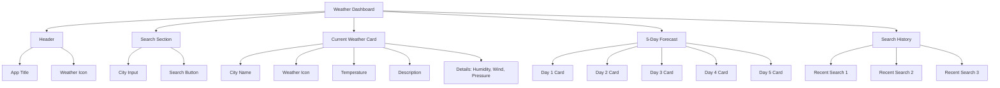
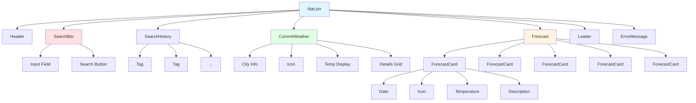
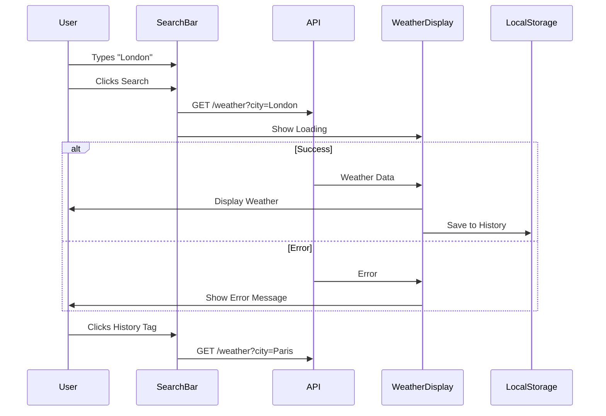
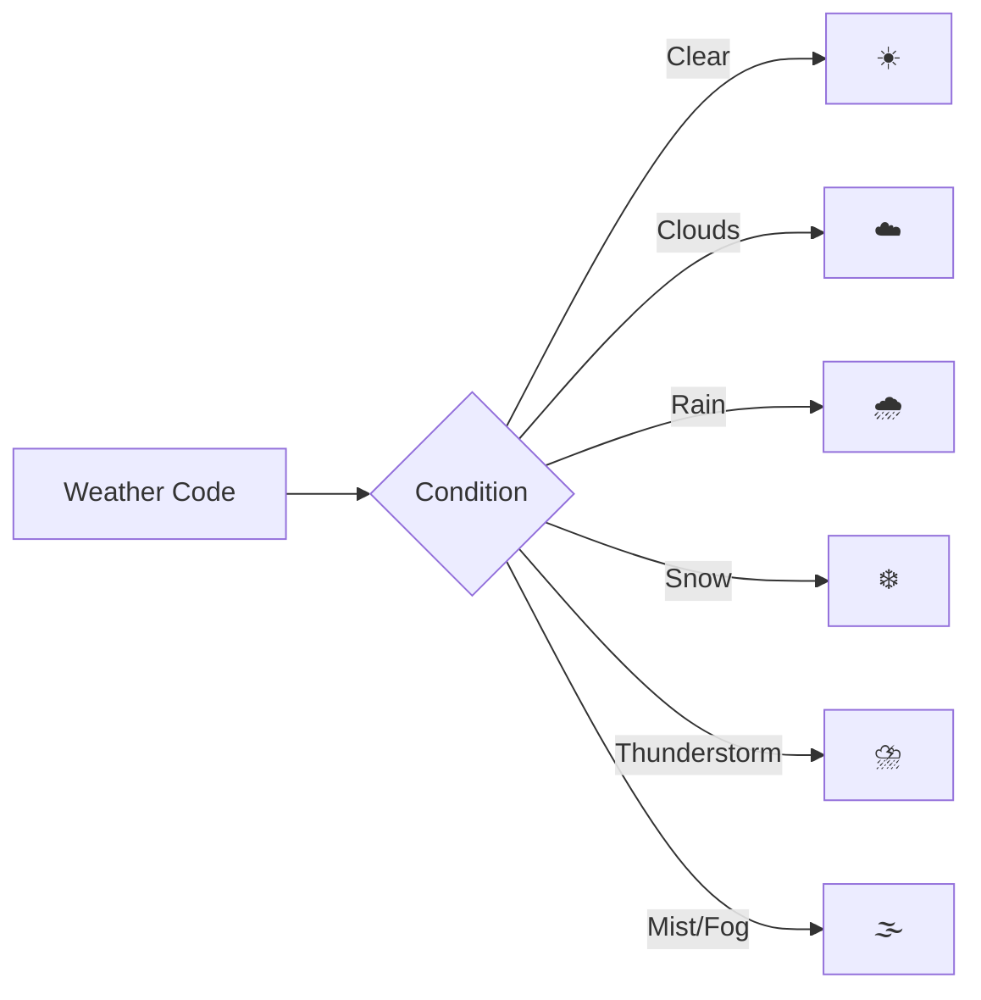
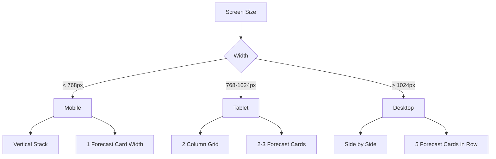

# 🌦️ Assignment 2: Weather Dashboard - UI Mockup

Visual guide showing the weather dashboard you'll build with API integration.

---

## 📱 Desktop Layout



---

## 🎨 Page Layout Wireframe

```
┌──────────────────────────────────────────────────────┐
│  ☁️ Weather Dashboard                               │  ← Header
└──────────────────────────────────────────────────────┘

┌──────────────────────────────────────────────────────┐
│  Search for a city:                                  │
│  [___London_____________________] [🔍 Search]        │  ← Search Bar
│                                                      │
│  Recent: [London] [Paris] [Tokyo] [New York]        │  ← History Tags
└──────────────────────────────────────────────────────┘

┌──────────────────────────────────────────────────────┐
│  London, GB                                      ☀️  │
│                                                      │
│          ☀️                                          │
│         25°C                                         │  ← Current Weather
│                                                      │
│      Clear Sky                                       │
│                                                      │
│  Feels like: 23°C  |  Humidity: 45%                 │
│  Wind: 5 m/s       |  Pressure: 1013 hPa            │
│  Sunrise: 06:30    |  Sunset: 20:45                 │
└──────────────────────────────────────────────────────┘

┌──────────────────────────────────────────────────────┐
│  5-Day Forecast                                      │
│                                                      │
│  ┌───────┐  ┌───────┐  ┌───────┐  ┌───────┐  ┌───────┐
│  │  Mon  │  │  Tue  │  │  Wed  │  │  Thu  │  │  Fri  │
│  │  ☀️   │  │  ⛅   │  │  🌧️   │  │  ☁️   │  │  ☀️   │
│  │  24°C │  │  22°C │  │  18°C │  │  20°C │  │  25°C │
│  │  Clear│  │Partly │  │ Rain  │  │Cloudy │  │ Clear │
│  └───────┘  └───────┘  └───────┘  └───────┘  └───────┘
└──────────────────────────────────────────────────────┘
```

---

## 📱 Mobile Layout

```
┌─────────────────┐
│ ☁️ Weather      │  ← Header
└─────────────────┘

┌─────────────────┐
│ [___Search___]  │  ← Search
│ [🔍 Search]     │
│                 │
│ [London][Paris] │  ← History (Wrap)
└─────────────────┘

┌─────────────────┐
│ London, GB  ☀️  │
│                 │
│      ☀️         │
│      25°C       │  ← Current (Full Width)
│                 │
│   Clear Sky     │
│                 │
│ Feels: 23°C     │
│ Humidity: 45%   │
│ Wind: 5 m/s     │
└─────────────────┘

┌─────────────────┐
│ 5-Day Forecast  │
│                 │
│ ┌─────────────┐ │
│ │ Mon    ☀️   │ │
│ │ 24°C  Clear │ │
│ └─────────────┘ │  ← Forecast (Vertical Stack)
│ ┌─────────────┐ │
│ │ Tue    ⛅   │ │
│ │ 22°C Partly │ │
│ └─────────────┘ │
└─────────────────┘
```

---

## 🧩 Component Hierarchy



---

## 🔄 User Flow



---

## 🎨 UI States

### 1. Initial State (No Search)
```
┌──────────────────────────────┐
│  Search for a city:          │
│  [___________________] [🔍]  │
│                              │
│  👋 Welcome to Weather App!  │
│  Search for any city above   │
└──────────────────────────────┘
```

### 2. Loading State
```
┌──────────────────────────────┐
│  Searching...                │
│                              │
│       ⏳ Loading...          │
│       [Spinner Animation]    │
└──────────────────────────────┘
```

### 3. Success State
```
┌──────────────────────────────┐
│  London, GB              ☀️  │
│  25°C - Clear Sky            │
│  [Full weather details]      │
└──────────────────────────────┘
```

### 4. Error State
```
┌──────────────────────────────┐
│  ❌ City not found!          │
│                              │
│  Please try another city     │
│  [Try Again]                 │
└──────────────────────────────┘
```

---

## 🎨 Weather Icons Mapping



---

## 🎯 Key Features Layout

### Search Bar with Validation
```
┌────────────────────────────────┐
│ City name:                     │
│ [___________________] [Search] │  ← Normal
└────────────────────────────────┘

┌────────────────────────────────┐
│ City name:                     │
│ [___________________] [Search] │  ← Focused (Blue border)
└────────────────────────────────┘

┌────────────────────────────────┐
│ City name:                     │
│ [___________________] [Search] │
│ ⚠️ Please enter a city name    │  ← Error
└────────────────────────────────┘
```

### Search History Tags
```
Recent Searches:
[London ×] [Paris ×] [Tokyo ×] [New York ×] [Clear All]

Click tag → Search that city
Click × → Remove from history
```

### Current Weather Card
```
┌─────────────────────────────────────┐
│  London, United Kingdom        ☀️   │
│  ─────────────────────────────────  │
│                                     │
│              ☀️                     │
│             25°C                    │
│          Clear Sky                  │
│                                     │
│  ┌────────────┬────────────────┐   │
│  │ Feels like │    Humidity    │   │
│  │    23°C    │      45%       │   │
│  ├────────────┼────────────────┤   │
│  │    Wind    │   Pressure     │   │
│  │   5 m/s    │   1013 hPa     │   │
│  ├────────────┼────────────────┤   │
│  │  Sunrise   │    Sunset      │   │
│  │   06:30    │     20:45      │   │
│  └────────────┴────────────────┘   │
└─────────────────────────────────────┘
```

### Forecast Card
```
┌──────────────┐
│   Monday     │
│   Jan 22     │
│      ☀️      │
│              │
│   High: 25°C │
│   Low:  18°C │
│              │
│  Clear Sky   │
└──────────────┘

Hover Effect:
- Card lifts
- Shadow increases
- Background color changes
```

---

## 📐 Responsive Breakpoints



---

## 🎨 Color Scheme

### Light Mode
```
Primary:     #3B82F6 (Blue)
Secondary:   #10B981 (Green)
Background:  #F3F4F6 (Light Gray)
Card:        #FFFFFF (White)
Text:        #1F2937 (Dark)
Border:      #E5E7EB (Light Gray)
Error:       #EF4444 (Red)
Success:     #10B981 (Green)
```

### Dark Mode (Optional)
```
Primary:     #60A5FA (Light Blue)
Background:  #1F2937 (Dark Gray)
Card:        #374151 (Medium Gray)
Text:        #F9FAFB (White)
Border:      #4B5563 (Gray)
```

---

## 🎬 Animations

1. **Search Button**: Pulse on click
2. **Loading**: Spinner rotation
3. **Weather Card**: Fade in from bottom
4. **Forecast Cards**: Stagger fade in (delay each)
5. **History Tags**: Slide in from right
6. **Error Message**: Shake animation
7. **Icon**: Bounce on load

---

## 📊 Data Display

### Temperature
```
Large: 25°C  (Main temperature)
Small: 18°C  (Feels like, min/max)
```

### Details Grid
```
┌────────────┬────────────┐
│ Label      │ Label      │
│ VALUE      │ VALUE      │
├────────────┼────────────┤
│ Label      │ Label      │
│ VALUE      │ VALUE      │
└────────────┴────────────┘
```

---

## ✅ UI Checklist

- [ ] Header with app name and icon
- [ ] Search input with placeholder
- [ ] Search button with icon
- [ ] Search history tags (max 5)
- [ ] Loading spinner during API call
- [ ] Current weather card
- [ ] Weather icon display
- [ ] Temperature (large font)
- [ ] Weather description
- [ ] Details grid (humidity, wind, etc.)
- [ ] 5-day forecast cards
- [ ] Error message component
- [ ] Empty state message
- [ ] Responsive design
- [ ] Hover effects on cards

---

## 📝 Notes

- Use Bootstrap classes for quick styling
- Weather icons can be from API or React Icons
- LocalStorage saves last 5 searches
- API calls should show loading state
- Handle all error cases gracefully
- Make temperature units clear (°C or °F)
- Consider adding unit toggle (optional)

---

**Use this mockup as your reference while building the weather dashboard!** 🌦️

