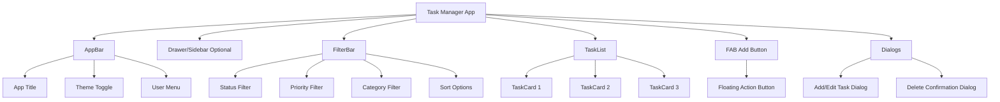
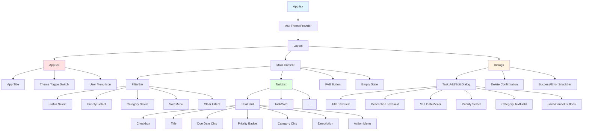
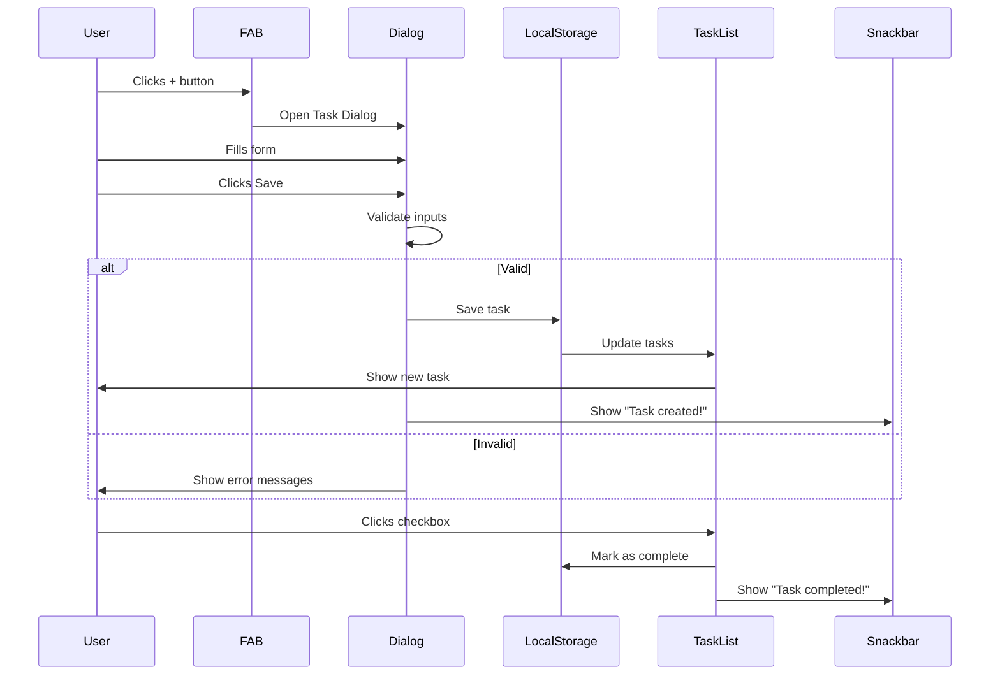
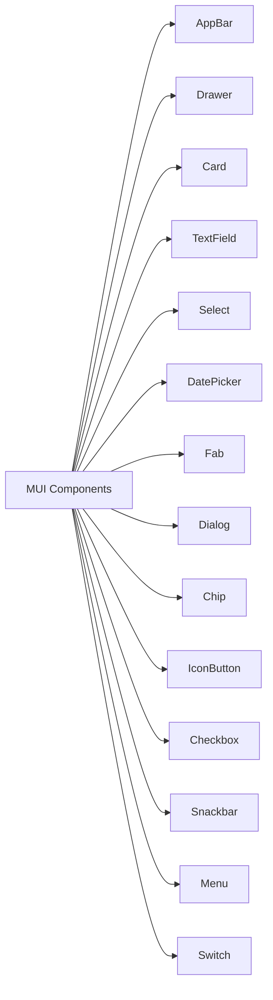

# ✅ Assignment 3: Task Management App - UI Mockup

Visual guide for building your Material-UI based task manager with dark mode support.

---

## 📱 Desktop Layout



---

## 🎨 Page Layout Wireframe

```
┌───────────────────────────────────────────────────────┐
│  ☰  My Task Manager        🌙  [Profile ▼]           │  ← AppBar (Fixed)
└───────────────────────────────────────────────────────┘

┌───────────────────────────────────────────────────────┐
│  📋 Tasks (12)                                        │
│                                                       │
│  [All ▼] [Priority: All ▼] [Category: All ▼] [Sort▼]│  ← FilterBar
└───────────────────────────────────────────────────────┘

┌───────────────────────────────────────────────────────┐
│  ┌──────────────────────────────────────────────┐    │
│  │  ✅ Complete React Assignment           [⋮] │    │
│  │  Due: Jan 25, 2025  🔴 High Priority        │    │
│  │  Work                                        │    │
│  │  Lorem ipsum description...                  │    │
│  └──────────────────────────────────────────────┘    │  ← TaskCard
│                                                       │
│  ┌──────────────────────────────────────────────┐    │
│  │  ⭕ Review pull requests               [⋮] │    │
│  │  Due: Jan 26, 2025  🟡 Medium Priority      │    │
│  │  Development                                 │    │
│  │  Review team's code changes...               │    │
│  └──────────────────────────────────────────────┘    │
│                                                       │
│  ┌──────────────────────────────────────────────┐    │
│  │  ⭕ Update documentation                [⋮] │    │
│  │  Due: Jan 28, 2025  🟢 Low Priority         │    │
│  │  Documentation                               │    │
│  │  Update API documentation...                 │    │
│  └──────────────────────────────────────────────┘    │
└───────────────────────────────────────────────────────┘

                                         [➕]  ← FAB (Bottom Right)

```

---

## 📱 Mobile Layout

```
┌────────────────┐
│ ☰ Tasks    🌙  │  ← AppBar
└────────────────┘

┌────────────────┐
│ [All ▼]        │
│ [Priority ▼]   │  ← Filters (Stacked)
│ [Category ▼]   │
└────────────────┘

┌────────────────┐
│ ┌────────────┐ │
│ │ ✅ Task    │ │
│ │ Due: Jan25 │ │  ← Cards (Full Width)
│ │ 🔴 High    │ │
│ └────────────┘ │
│ ┌────────────┐ │
│ │ ⭕ Task    │ │
│ └────────────┘ │
└────────────────┘

      [➕]  ← FAB
```

---

## 🧩 Component Hierarchy



---

## 🔄 User Flow



---

## 🎨 Task Card States

### Active Task
```
┌────────────────────────────────────────────┐
│  ⭕  Complete React Assignment        [⋮]  │
│                                            │
│  📅 Jan 25, 2025  🔴 High  💼 Work        │
│                                            │
│  Need to finish all components and         │
│  deploy to production.                     │
│                                            │
│  [✏️ Edit] [🗑️ Delete]                     │
└────────────────────────────────────────────┘
```

### Completed Task
```
┌────────────────────────────────────────────┐
│  ✅  Complete React Assignment        [⋮]  │  ← Strikethrough text
│                                            │  ← Lighter background
│  📅 Jan 25, 2025  🔴 High  💼 Work        │  ← Opacity reduced
│                                            │
│  Need to finish all components and         │
│  deploy to production.                     │
│                                            │
│  [✏️ Edit] [🗑️ Delete]                     │
└────────────────────────────────────────────┘
```

### Hover State
```
┌────────────────────────────────────────────┐
│  ⭕  Complete React Assignment        [⋮]  │  ← Elevated shadow
│                                            │  ← Slight scale up
│  📅 Jan 25, 2025  🔴 High  💼 Work        │  ← Border highlight
└────────────────────────────────────────────┘
```

---

## 🎯 Add/Edit Task Dialog

```
┌─────────────────────────────────────────────┐
│  Add New Task                          [×]  │
├─────────────────────────────────────────────┤
│                                             │
│  Task Title *                               │
│  [_________________________________]        │
│                                             │
│  Description                                │
│  [_________________________________]        │
│  [_________________________________]        │
│  [_________________________________]        │
│                                             │
│  Due Date *                                 │
│  [Jan 25, 2025                    ] 📅     │
│                                             │
│  Priority *                                 │
│  ( ) Low  (•) Medium  ( ) High              │
│                                             │
│  Category                                   │
│  [Work                            ▼]        │
│                                             │
│  Tags (optional)                            │
│  [urgent] [react] [+Add Tag]                │
│                                             │
├─────────────────────────────────────────────┤
│                      [Cancel]  [Save Task]  │
└─────────────────────────────────────────────┘
```

---

## 🎨 Filter Bar

```
┌─────────────────────────────────────────────────────┐
│  📋 My Tasks (24 total, 12 active)                  │
│                                                     │
│  Status:     [All Tasks      ▼]                    │
│  Priority:   [All Priorities ▼]                    │
│  Category:   [All Categories ▼]                    │
│  Sort by:    [Due Date      ▼]                     │
│                                                     │
│  [🔄 Clear Filters]                                 │
└─────────────────────────────────────────────────────┘

Dropdown Options:

Status:
• All Tasks
• Active
• Completed

Priority:
• All Priorities  
• High
• Medium
• Low

Sort by:
• Due Date (Nearest first)
• Priority (High to Low)
• Created Date (Newest first)
• Title (A-Z)
```

---

## 🎨 Priority Badges

```
🔴 High Priority     → Red chip
🟡 Medium Priority   → Orange chip
🟢 Low Priority      → Green chip
```

---

## 🎨 Theme Toggle

### Light Mode
```
AppBar: Primary Blue
Background: White/Light Gray
Cards: White
Text: Dark Gray
```

### Dark Mode
```
AppBar: Dark Blue
Background: Dark Gray (#1F2937)
Cards: Medium Gray (#374151)
Text: White
```

Theme Toggle Button:
```
Light Mode: ☀️ (Yellow icon)
Dark Mode:  🌙 (Blue icon)
```

---

## 🎨 Empty States

### No Tasks
```
┌─────────────────────────────┐
│                             │
│          📝                 │
│                             │
│    No tasks yet!            │
│    Click + to add your      │
│    first task               │
│                             │
│         [+ Add Task]        │
│                             │
└─────────────────────────────┘
```

### No Filtered Results
```
┌─────────────────────────────┐
│                             │
│          🔍                 │
│                             │
│    No tasks found           │
│    Try different filters    │
│                             │
│      [Clear Filters]        │
│                             │
└─────────────────────────────┘
```

---

## 🎬 Animations

1. **FAB**: Rotate 45° when clicked
2. **Dialog**: Slide up from bottom
3. **Task Cards**: Stagger fade-in on load
4. **Complete Task**: Check animation + fade out
5. **Delete**: Slide out to right
6. **Snackbar**: Slide in from bottom
7. **Theme Toggle**: Smooth color transition
8. **Filters**: Expand/collapse animation

---

## 📊 MUI Components Used



---

## ✅ UI Checklist

- [ ] MUI AppBar with title and theme toggle
- [ ] Theme toggle switch (light/dark)
- [ ] Filter bar with dropdowns
- [ ] Task cards in grid/list
- [ ] Checkbox for complete/incomplete
- [ ] Priority badges (color-coded)
- [ ] Due date chips
- [ ] Category tags
- [ ] FAB for adding tasks
- [ ] Task dialog (add/edit)
- [ ] MUI DatePicker
- [ ] Delete confirmation dialog
- [ ] Success/error snackbars
- [ ] Empty state messages
- [ ] Loading states (if needed)
- [ ] Responsive layout
- [ ] Dark mode support
- [ ] Smooth animations

---

## 🎨 Color Palette

### Light Theme
```
Primary:    #1976D2 (Blue)
Secondary:  #DC004E (Pink)
Background: #FAFAFA (Light Gray)
Surface:    #FFFFFF (White)
Text:       #212121 (Dark Gray)
Error:      #D32F2F (Red)
Success:    #388E3C (Green)
Warning:    #F57C00 (Orange)
```

### Dark Theme
```
Primary:    #90CAF9 (Light Blue)
Secondary:  #F48FB1 (Light Pink)
Background: #121212 (Almost Black)
Surface:    #1E1E1E (Dark Gray)
Text:       #FFFFFF (White)
Error:      #EF5350 (Light Red)
Success:    #66BB6A (Light Green)
Warning:    #FFA726 (Light Orange)
```

---

## 📝 Notes

- Use MUI's built-in theme system
- Leverage MUI Grid for responsive layout
- Use MUI icons for consistency
- LocalStorage stores all tasks
- Form validation with MUI helpers
- Snackbar auto-dismiss after 3s
- Support keyboard shortcuts (optional)
- Add task search (optional bonus)

---

**Follow this mockup to build a professional-looking task manager!** ✅

