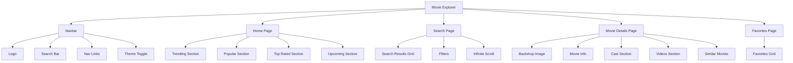
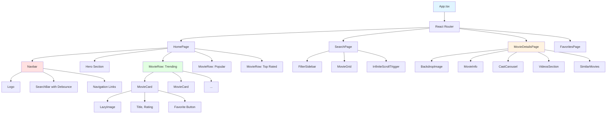
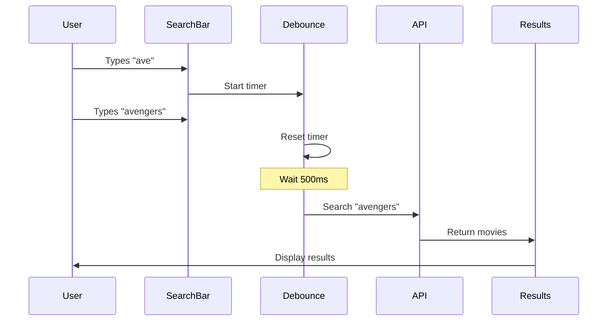
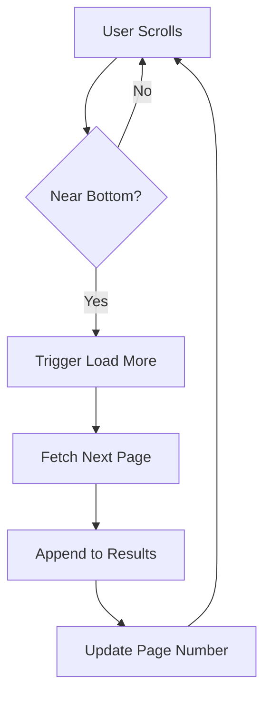

# 🎬 Assignment 5: Movie Database Explorer - UI Mockup

Visual guide for building your advanced movie explorer with Tailwind CSS and animations.

---

## 📱 Desktop Layout



---

## 🎨 Home Page Layout

```
┌──────────────────────────────────────────────────────────────┐
│  🎬 MovieDB    [Search movies...]   Home Favorites Profile   │  ← Navbar
└──────────────────────────────────────────────────────────────┘

┌──────────────────────────────────────────────────────────────┐
│  Trending This Week                              [See All →] │
│                                                              │
│  ◄ [🎬] [🎬] [🎬] [🎬] [🎬] [🎬] [🎬] [🎬] ►              │  ← Horizontal Scroll
│                                                              │
└──────────────────────────────────────────────────────────────┘

┌──────────────────────────────────────────────────────────────┐
│  Popular Movies                                   [See All →]│
│                                                              │
│  ┌────────┐  ┌────────┐  ┌────────┐  ┌────────┐  ┌────────┐│
│  │  📷    │  │  📷    │  │  📷    │  │  📷    │  │  📷    ││
│  │ Poster │  │ Poster │  │ Poster │  │ Poster │  │ Poster ││
│  │        │  │        │  │        │  │        │  │        ││
│  │ Title  │  │ Title  │  │ Title  │  │ Title  │  │ Title  ││
│  │⭐ 8.5  │  │⭐ 7.9  │  │⭐ 8.2  │  │⭐ 7.5  │  │⭐ 8.8  ││
│  │ ❤️     │  │ ❤️     │  │ ❤️     │  │ ❤️     │  │ ❤️     ││
│  └────────┘  └────────┘  └────────┘  └────────┘  └────────┘│
│                                                              │
│  ┌────────┐  ┌────────┐  ┌────────┐  ┌────────┐  ┌────────┐│
│  │  📷    │  │  📷    │  │  📷    │  │  📷    │  │  📷    ││
│  └────────┘  └────────┘  └────────┘  └────────┘  └────────┘│
└──────────────────────────────────────────────────────────────┘

[Load More...]  ← Infinite Scroll Trigger

┌──────────────────────────────────────────────────────────────┐
│  Top Rated                                        [See All →]│
│  [Similar grid of movie posters]                             │
└──────────────────────────────────────────────────────────────┘
```

---

## 🔍 Search Results Page

```
┌──────────────────────────────────────────────────────────────┐
│  🎬 MovieDB  [avengers____________]  🔍                      │
└──────────────────────────────────────────────────────────────┘

┌───────────┬──────────────────────────────────────────────────┐
│ Filters   │  Search Results for "avengers" (124 movies)     │
│           │                                                   │
│ Genre     │  ┌────────┐  ┌────────┐  ┌────────┐  ┌────────┐│
│ □ Action  │  │  📷    │  │  📷    │  │  📷    │  │  📷    ││
│ □ Drama   │  │ Poster │  │ Poster │  │ Poster │  │ Poster ││
│ □ Comedy  │  │ Title  │  │ Title  │  │ Title  │  │ Title  ││
│           │  │⭐ 8.5  │  │⭐ 7.9  │  │⭐ 8.2  │  │⭐ 7.5  ││
│ Year      │  │ ❤️     │  │ ❤️     │  │ ❤️     │  │ ❤️     ││
│ ━●━━━━━━  │  └────────┘  └────────┘  └────────┘  └────────┘│
│2000  2024 │                                                   │
│           │  ┌────────┐  ┌────────┐  ┌────────┐  ┌────────┐│
│ Rating    │  │  📷    │  │  📷    │  │  📷    │  │  📷    ││
│⭐ 7.0+    │  └────────┘  └────────┘  └────────┘  └────────┘│
│           │                                                   │
│ Sort      │  [Loading more...]                               │
│ ● Popular │                                                   │
│ ○ Latest  │                                                   │
│ ○ Rating  │                                                   │
└───────────┴──────────────────────────────────────────────────┘
```

---

## 🎬 Movie Details Page

```
┌──────────────────────────────────────────────────────────────┐
│                                                              │
│              ═══════════════════════════                     │
│              ║   BACKDROP IMAGE      ║                     │  ← Large backdrop
│              ║   (Gradient overlay)   ║                     │
│              ═══════════════════════════                     │
│                                                              │
└──────────────────────────────────────────────────────────────┘

┌─────────────┬────────────────────────────────────────────────┐
│             │  The Avengers                            ❤️    │
│   ┌─────┐   │  Action, Adventure, Sci-Fi               Fav  │
│   │     │   │  ⭐ 8.0 (1.2M reviews)                        │
│   │Post │   │  2h 23min  •  2012  •  PG-13                 │
│   │ er  │   │                                               │
│   │     │   │  "Earth's mightiest heroes must come         │
│   │Imag │   │   together to stop Loki..."                  │
│   │ e   │   │                                               │
│   │     │   │  [▶️ Watch Trailer]  [🔗 Share]              │
│   └─────┘   │                                               │
└─────────────┴────────────────────────────────────────────────┘

┌──────────────────────────────────────────────────────────────┐
│  Cast                                                        │
│  ◄ [👤] [👤] [👤] [👤] [👤] [👤] [👤] [👤] ►              │  ← Horizontal scroll
│     Name    Name    Name    Name                            │
│   Character Character Character                             │
└──────────────────────────────────────────────────────────────┘

┌──────────────────────────────────────────────────────────────┐
│  Videos & Trailers                                           │
│  ┌─────────────┐  ┌─────────────┐  ┌─────────────┐         │
│  │  ▶️         │  │  ▶️         │  │  ▶️         │         │
│  │  Trailer 1  │  │  Trailer 2  │  │  Behind...  │         │
│  └─────────────┘  └─────────────┘  └─────────────┘         │
└──────────────────────────────────────────────────────────────┘

┌──────────────────────────────────────────────────────────────┐
│  Similar Movies                                              │
│  [Grid of similar movie posters]                            │
└──────────────────────────────────────────────────────────────┘
```

---

## 🧩 Component Hierarchy



---

## 🎯 Movie Card States

### Normal State
```
┌──────────┐
│          │
│  🎬      │
│  Image   │
│          │
├──────────┤
│ Title    │
│ ⭐ 8.5   │
│ ❤️       │
└──────────┘
```

### Hover State (with Framer Motion)
```
┌──────────┐  ← Scale up (1.05)
│   ✨     │  ← Glow effect
│  🎬      │  ← Image zoom in
│  Image   │  ← Overlay appears
│  ▶️      │  ← Play icon appears
├──────────┤
│ Title    │  ← Text color change
│ ⭐ 8.5   │
│ 💗       │  ← Heart filled
└──────────┘
```

### Loading State (Skeleton)
```
┌──────────┐
│ ▒▒▒▒▒▒▒▒ │  ← Shimmer animation
│ ▒▒▒▒▒▒▒▒ │
│ ▒▒▒▒▒▒▒▒ │
│ ▒▒▒▒▒▒▒▒ │
├──────────┤
│ ▒▒▒▒     │
│ ▒▒▒      │
└──────────┘
```

---

## 📱 Mobile Layout

```
┌────────────────┐
│ 🎬  [Search] ☰ │  ← Mobile Navbar
└────────────────┘

┌────────────────┐
│  Trending      │
│  ◄ [🎬][🎬] ► │  ← Horizontal scroll
└────────────────┘

┌────────────────┐
│  Popular       │
│  ┌──────────┐  │
│  │   🎬     │  │
│  │  Poster  │  │  ← 2-3 columns
│  │  Title   │  │
│  │  ⭐ 8.5  │  │
│  └──────────┘  │
│  ┌──────────┐  │
│  │   🎬     │  │
│  └──────────┘  │
└────────────────┘

[Infinite Scroll...]
```

---

## 🔍 Search with Debouncing



---

## ∞ Infinite Scroll Implementation



---

## 🎬 Animations with Framer Motion

### Page Transition
```jsx
// Fade in on page load
initial={{ opacity: 0 }}
animate={{ opacity: 1 }}
exit={{ opacity: 0 }}
transition={{ duration: 0.3 }}
```

### Movie Card Hover
```jsx
// Scale and lift
whileHover={{ 
  scale: 1.05,
  y: -10,
  transition: { duration: 0.2 }
}}
```

### Stagger Children
```jsx
// Cards appear one by one
variants={{
  hidden: { opacity: 0 },
  show: {
    opacity: 1,
    transition: {
      staggerChildren: 0.1
    }
  }
}}
```

---

## 🎨 Tailwind CSS Classes Examples

### Movie Card
```jsx
<div className="relative rounded-lg overflow-hidden shadow-lg 
                hover:shadow-2xl transform hover:scale-105 
                transition-all duration-300 cursor-pointer
                bg-gray-800">
  {/* Card content */}
</div>
```

### Search Bar
```jsx
<input className="w-full px-4 py-2 rounded-full 
                  bg-gray-800 text-white 
                  focus:outline-none focus:ring-2 
                  focus:ring-blue-500 transition-all" />
```

### Rating Badge
```jsx
<span className="absolute top-2 right-2 
                 bg-yellow-400 text-black 
                 px-2 py-1 rounded-full text-sm font-bold">
  ⭐ 8.5
</span>
```

---

## ✅ UI Checklist

- [ ] Navbar with search
- [ ] Debounced search input
- [ ] Home page with sections
- [ ] Horizontal scrolling rows
- [ ] Movie cards with lazy images
- [ ] Loading skeletons
- [ ] Hover animations (Framer Motion)
- [ ] Favorite button with animation
- [ ] Search page with filters
- [ ] Infinite scroll
- [ ] Movie details page
- [ ] Backdrop image with gradient
- [ ] Cast carousel (horizontal scroll)
- [ ] Video thumbnails
- [ ] Similar movies section
- [ ] Favorites page
- [ ] Empty states
- [ ] Page transitions
- [ ] Responsive design
- [ ] Dark theme

---

## 🎨 Color Scheme (Dark Theme)

```
Background: #0F172A (Dark Blue-Gray)
Surface:    #1E293B (Lighter Blue-Gray)
Card:       #334155 (Card Background)
Primary:    #3B82F6 (Blue)
Secondary:  #8B5CF6 (Purple)
Accent:     #F59E0B (Orange)
Text:       #F1F5F9 (Light Gray)
Muted:      #64748B (Gray)
Rating:     #FBBF24 (Gold)
```

---

## 🎬 Key Features Layout

### Horizontal Movie Row
```
Trending This Week                    [See All →]

◄ ┌─────┐ ┌─────┐ ┌─────┐ ┌─────┐ ┌─────┐ ►
  │ 🎬  │ │ 🎬  │ │ 🎬  │ │ 🎬  │ │ 🎬  │
  │Title│ │Title│ │Title│ │Title│ │Title│
  │⭐8.5│ │⭐7.9│ │⭐8.2│ │⭐7.5│ │⭐8.8│
  └─────┘ └─────┘ └─────┘ └─────┘ └─────┘
  
← Drag to scroll or use arrows →
```

### Cast Member Card
```
┌──────────┐
│  👤      │  ← Profile photo
│  Photo   │
├──────────┤
│ Actor    │  ← Name
│ Name     │
├──────────┤
│Character │  ← Character name
│Name      │
└──────────┘
```

---

## 📊 Performance Optimizations

1. **Image Lazy Loading**
   - Load images only when in viewport
   - Use placeholder while loading

2. **Debounced Search**
   - Wait 500ms after typing stops
   - Prevent excessive API calls

3. **Infinite Scroll**
   - Load 20 movies at a time
   - Pagination with TMDB API

4. **React.memo**
   - Memoize movie cards
   - Prevent unnecessary re-renders

5. **Virtual Scrolling** (Optional)
   - Only render visible items
   - Better performance with many items

---

## 📝 Notes

- Use TMDB API for movie data
- Images from TMDB image CDN
- Tailwind for styling (utility-first)
- Framer Motion for animations
- Intersection Observer for lazy loading
- LocalStorage for favorites
- React Router for navigation
- Responsive breakpoints: sm, md, lg, xl

---

**Build a stunning movie explorer with smooth animations!** 🎬

