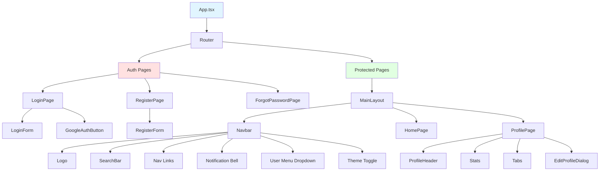

# 🔐 Assignment 6: Authentication & Foundation - UI Mockup

ConnectHub: Social Media Dashboard - Authentication System

---

## 🎨 Login Page

```
┌────────────────────────────────────────┐
│                                        │
│          ConnectHub                    │  ← Logo/Brand
│      Connect.Share.Engage              │
│                                        │
│  ┌──────────────────────────────────┐  │
│  │  Email                           │  │
│  │  [__________________________]    │  │
│  │                                  │  │
│  │  Password                        │  │
│  │  [__________________________] 👁️ │  │
│  │                                  │  │
│  │  □ Remember me                   │  │
│  │                                  │  │
│  │  [Login]                         │  │
│  │                                  │  │
│  │  Forgot password?                │  │
│  └──────────────────────────────────┘  │
│                                        │
│  ──────── OR ────────                  │
│                                        │
│  [🔵 Continue with Google]             │
│                                        │
│  Don't have an account? Sign up        │
└────────────────────────────────────────┘
```

---

## 🎨 Registration Page

```
┌────────────────────────────────────────┐
│          Create Account                │
│                                        │
│  Full Name                             │
│  [_______________________________]     │
│                                        │
│  Email                                 │
│  [_______________________________]     │
│                                        │
│  Password                              │
│  [_______________________________] 👁️  │
│  • At least 8 characters               │
│                                        │
│  Confirm Password                      │
│  [_______________________________] 👁️  │
│                                        │
│  □ I agree to Terms & Conditions       │
│                                        │
│  [Create Account]                      │
│                                        │
│  Already have an account? Login        │
└────────────────────────────────────────┘
```

---

## 🏠 Home Page (After Login)

```
┌──────────────────────────────────────────────────────────┐
│ ☰ ConnectHub    Home  Explore  [Search]  🔔  [Profile▼] │  ← Navbar
└──────────────────────────────────────────────────────────┘

┌─────────────┬────────────────────────┬─────────────────┐
│             │                        │                 │
│  Profile    │  Feed                  │  Suggestions    │
│  ┌────┐     │  ┌──────────────────┐  │  ┌──────────┐  │
│  │ 👤 │     │  │ What's on your   │  │  │ 👤 User1 │  │
│  └────┘     │  │ mind?            │  │  │ [Follow] │  │
│  John Doe   │  │ [Post]           │  │  └──────────┘  │
│             │  └──────────────────┘  │  ┌──────────┐  │
│  100 Posts  │                        │  │ 👤 User2 │  │
│  500 Follow │  Post Feed...          │  │ [Follow] │  │
│             │  (Added in Assign 7)   │  └──────────┘  │
│  [Profile]  │                        │                 │
│             │                        │  Trending       │
│             │                        │  #ReactJS       │
└─────────────┴────────────────────────┴─────────────────┘
```

---

## 👤 Profile Page

```
┌──────────────────────────────────────────────────┐
│  [← Back]                                        │
└──────────────────────────────────────────────────┘

┌──────────────────────────────────────────────────┐
│             Cover Photo                      [✏️] │  ← Edit button
├──────────────────────────────────────────────────┤
│  ┌────┐                                          │
│  │ 👤 │  John Doe                           [✏️] │
│  │    │  @johndoe                                │
│  └────┘  Software Developer                      │
│          📍 San Francisco                        │
│          🔗 johndoe.com                          │
│          📅 Joined January 2025                  │
│                                                  │
│  Bio: Full-stack developer passionate about...  │
│                                                  │
│  ┌───────┐  ┌───────┐  ┌───────┐              │
│  │  120  │  │  500  │  │  350  │              │
│  │ Posts │  │Follow │  │Follow │              │
│  │       │  │  ers  │  │  ing  │              │
│  └───────┘  └───────┘  └───────┘              │
└──────────────────────────────────────────────────┘

┌──────────────────────────────────────────────────┐
│  [Posts] [About] [Photos]  ← Tabs               │
│                                                  │
│  Your posts will appear here...                 │
│  (Added in Assignment 7)                        │
└──────────────────────────────────────────────────┘
```

---

## ✏️ Edit Profile Dialog

```
┌──────────────────────────────────┐
│  Edit Profile              [×]   │
├──────────────────────────────────┤
│                                  │
│  Profile Photo                   │
│  ┌────┐  [Upload New]            │
│  │ 👤 │                           │
│  └────┘                           │
│                                  │
│  Display Name                    │
│  [John Doe_______________]       │
│                                  │
│  Bio                             │
│  [_______________________]       │
│  [_______________________]       │
│                                  │
│  Location                        │
│  [San Francisco__________]       │
│                                  │
│  Website                         │
│  [johndoe.com___________]        │
│                                  │
├──────────────────────────────────┤
│         [Cancel]  [Save Changes] │
└──────────────────────────────────┘
```

---

## 🎨 Theme Toggle

```
Light Mode:  ☀️  [     ○] 🌙
                    ↓
Dark Mode:   ☀️  [○     ] 🌙

Effect:
- Navbar: White → Dark Gray
- Background: Light → Dark
- Cards: White → Dark Gray
- Text: Dark → Light
- Smooth transition
```

---

## 🧩 Component Hierarchy



---

## ✅ UI Checklist Assignment 6

- [ ] Login page with form
- [ ] Register page with validation
- [ ] Google OAuth button
- [ ] Password visibility toggle
- [ ] Forgot password link/page
- [ ] Form validation messages
- [ ] Loading states during auth
- [ ] Success/error notifications
- [ ] Protected route component
- [ ] Redirect logic (logged in → home, logged out → login)
- [ ] Navbar with user menu
- [ ] Profile page
- [ ] Edit profile dialog
- [ ] Avatar upload
- [ ] Profile stats display
- [ ] Theme toggle (light/dark)
- [ ] Responsive design
- [ ] Smooth page transitions

---

## 🎨 Color Scheme

### Light Theme
```
Primary:    #1976D2 (Blue)
Background: #F5F5F5 (Light Gray)
Surface:    #FFFFFF (White)
Text:       #212121 (Dark)
```

### Dark Theme
```
Primary:    #90CAF9 (Light Blue)
Background: #121212 (Almost Black)
Surface:    #1E1E1E (Dark Gray)
Text:       #FFFFFF (White)
```

---

## 📝 Notes for Assignment 6

- Focus on authentication flow
- Firebase Auth integration
- Protected routes setup
- Profile management
- Theme system
- No posts/feed yet (Assignment 7)
- Keep it simple and functional
- Test all auth scenarios

---

**Build a solid foundation with secure authentication!** 🔐

