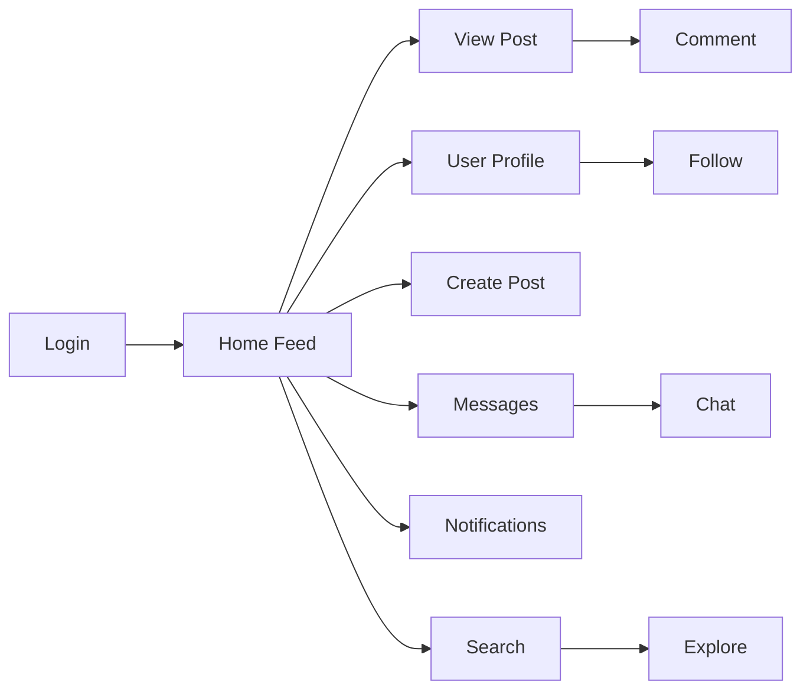

# 🎨 Assignments 7-10: Comprehensive App UI Mockups

Quick reference mockups for the remaining comprehensive app features.

---

## 📝 Assignment 7: Dashboard & Posts

### Post Creation
```
┌────────────────────────────────────┐
│ What's on your mind, John?         │
│ [____________________________]     │
│ [____________________________]     │
│                                    │
│ [📷 Photo] [🎥 Video] [😊 Emoji]  │
│                           [Post]   │
└────────────────────────────────────┘
```

### Post Card
```
┌────────────────────────────────────┐
│ 👤 John Doe          2h ago   [⋮] │
│                                    │
│ Just finished my React project!   │
│ #React #WebDev                    │
│                                    │
│ ┌──────────────────────────────┐  │
│ │     📷 Image                 │  │
│ └──────────────────────────────┘  │
│                                    │
│ 👍 45  💬 12  🔄 5  📌 Save       │
└────────────────────────────────────┘
```

### Dashboard Analytics
```
┌─────────┬─────────┬─────────┬─────────┐
│ 📊 120  │ 👍 450  │ 💬 89   │ 👥 500  │
│ Posts   │ Likes   │Comments │Followers│
└─────────┴─────────┴─────────┴─────────┘

[Chart: Posts over time - Line graph]
[Chart: Engagement - Bar graph]
```

---

## 💬 Assignment 8: Social Features

### Comments Section
```
┌────────────────────────────────────┐
│ Comments (12)                      │
│                                    │
│ 👤 Alice  5m ago                   │
│    Great post! Love it 💙          │
│    [Like] [Reply]                  │
│                                    │
│    └─ 👤 John  2m ago              │
│       Thanks Alice!                │
│       [Like]                       │
│                                    │
│ 👤 Bob  10m ago                    │
│    Very informative!               │
│    [Like] [Reply]                  │
│                                    │
│ [Write a comment...]               │
└────────────────────────────────────┘
```

### Notifications Center
```
┌────────────────────────────────────┐
│ Notifications              [🔔 12] │
├────────────────────────────────────┤
│ ● 👤 Alice liked your post (2m)   │
│ ● 👤 Bob commented on post (5m)   │
│ ○ 👤 Carol followed you (1h)      │
│ ○ 👤 Dave shared your post (2h)   │
│                                    │
│ [Mark all as read]                 │
└────────────────────────────────────┘
```

### User Profile (Others)
```
┌────────────────────────────────────┐
│ 👤 Alice Smith        [Follow]     │
│ @alicesmith                        │
│ Designer & Developer               │
│                                    │
│ 150 Posts | 2K Followers | 500... │
│                                    │
│ [Posts] [About] [Photos]           │
│                                    │
│ [Alice's posts appear here...]     │
└────────────────────────────────────┘
```

---

## 💬 Assignment 9: Real-time Features

### Chat List
```
┌────────────────────────────────────┐
│ Messages                     [✏️]  │
├────────────────────────────────────┤
│ 🟢 Alice       Hey! How are...  2m │
│ 🔴 Bob         Thanks for the... 1h│
│ 🟢 Carol      See you tomorro... 2h│
│ 🔴 Dave        The project is... 1d│
└────────────────────────────────────┘
```

### Chat Window
```
┌────────────────────────────────────┐
│ 🟢 Alice Smith            [× ] [⋮] │
├────────────────────────────────────┤
│                                    │
│     Hey John! 👋         10:30 AM  │
│  ┌──────────────┐                  │
│  │ Hi Alice!    │         10:32 AM │
│  └──────────────┘                  │
│                                    │
│     How's your project?  10:33 AM  │
│  ┌──────────────┐                  │
│  │ Going great! │         10:35 AM │
│  │ Almost done  │                  │
│  └──────────────┘                  │
│                                    │
│  Alice is typing...                │
│                                    │
├────────────────────────────────────┤
│ [Type a message...]          [📎] │
└────────────────────────────────────┘
```

### Search & Explore
```
┌────────────────────────────────────┐
│ [Search users, posts, tags...]  🔍 │
├────────────────────────────────────┤
│ Trending                           │
│ #️⃣ ReactJS    📈 1.2K posts       │
│ #️⃣ WebDev     📈 890 posts        │
│ #️⃣ JavaScript 📈 750 posts        │
│                                    │
│ Suggested Users                    │
│ [User cards with follow buttons]   │
└────────────────────────────────────┘
```

---

## 🧪 Assignment 10: Testing & Production

### Test Coverage Report
```
┌────────────────────────────────────┐
│ Test Coverage Report               │
├────────────────────────────────────┤
│ Statements:   85% ████████░░       │
│ Branches:     78% ███████░░░       │
│ Functions:    82% ████████░░       │
│ Lines:        87% ████████░░       │
│                                    │
│ ✅ 124 tests passed                │
│ ❌ 0 tests failed                  │
│ ⏭️  2 tests skipped                │
└────────────────────────────────────┘
```

### Performance Dashboard
```
┌────────────────────────────────────┐
│ Lighthouse Scores                  │
├────────────────────────────────────┤
│ Performance:  92 🟢               │
│ Accessibility: 95 🟢              │
│ Best Practices: 88 🟡             │
│ SEO:          90 🟢               │
│                                    │
│ FCP: 1.2s  |  LCP: 2.1s           │
│ TTI: 3.5s  |  TBT: 200ms          │
└────────────────────────────────────┘
```

### CI/CD Pipeline
```
┌────────────────────────────────────┐
│ GitHub Actions - Build Status      │
├────────────────────────────────────┤
│ ✅ Install Dependencies            │
│ ✅ Lint Code                       │
│ ✅ Run Tests                       │
│ ✅ Build Application               │
│ ✅ Deploy to Vercel                │
│                                    │
│ Build #42 - 3m 24s                │
│ Branch: main                       │
│ Commit: feat: add chat feature     │
└────────────────────────────────────┘
```

---

## 📊 Complete App Flow



---

## ✅ Complete Feature List

### Assignment 7
- ✅ Create, edit, delete posts
- ✅ Like and save posts
- ✅ Image/video uploads
- ✅ Feed with pagination
- ✅ Dashboard analytics

### Assignment 8
- ✅ Comments and replies
- ✅ User profiles
- ✅ Follow/unfollow
- ✅ Notifications
- ✅ Activity feed

### Assignment 9
- ✅ Real-time chat
- ✅ Online status
- ✅ Typing indicators
- ✅ Search users/posts
- ✅ Explore trending

### Assignment 10
- ✅ Unit tests
- ✅ Integration tests
- ✅ Performance optimization
- ✅ CI/CD pipeline
- ✅ Production deployment

---

**Build a complete, production-ready social media platform!** 🚀
