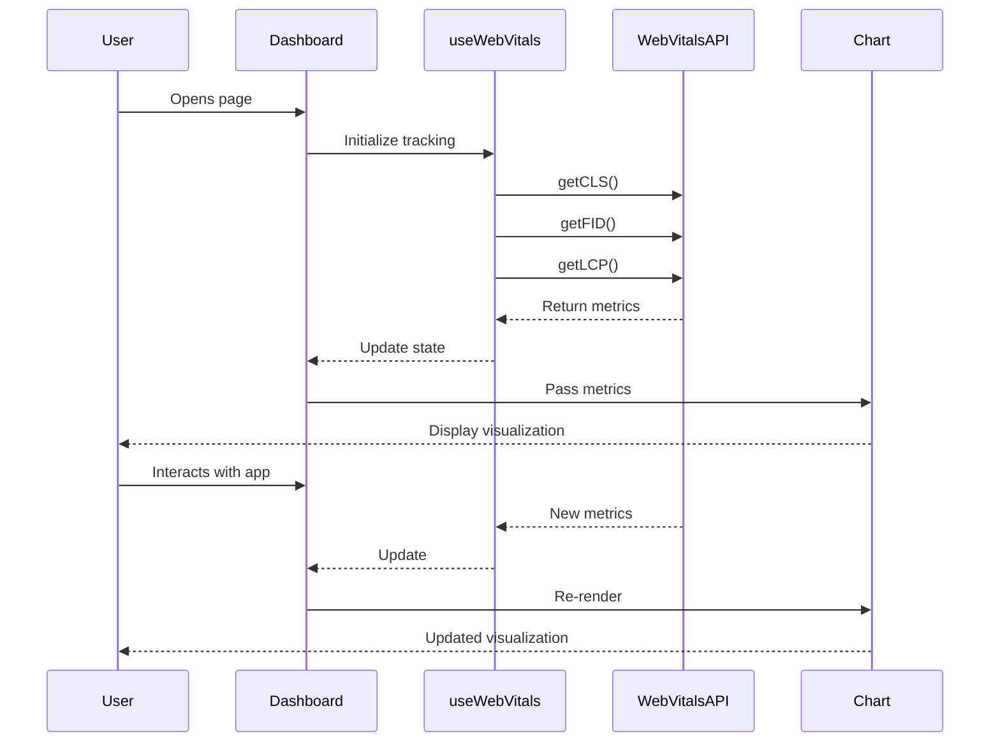

```mermaid
graph TB
    App[App.tsx]
    App --> Dashboard[PerformanceDashboard]
    App --> Audit[AuditResults]
    App --> Examples[OptimizationExamples]
    
    Dashboard --> Vitals[WebVitalsSection]
    Dashboard --> Charts[MetricsCharts]
    Dashboard --> Bundle[BundleAnalysis]
    Dashboard --> Checklist[OptimizationChecklist]
    
    Vitals --> Card1[MetricsCard - LCP]
    Vitals --> Card2[MetricsCard - FID]
    Vitals --> Card3[MetricsCard - CLS]
    Vitals --> Card4[MetricsCard - TTFB]
    Vitals --> Card5[MetricsCard - FCP]
    
    Charts --> LineChart[WebVitalsChart]
    Charts --> useWebVitals[useWebVitals hook]
    
    Bundle --> Treemap[BundleSizeTreemap]
    Bundle --> Analysis[SizeBreakdown]
    
    Checklist --> Category1[ComponentsChecklist]
    Checklist --> Category2[BundleChecklist]
    Checklist --> Category3[ImagesChecklist]
    
    Audit --> Compare[BeforeAfter]
    Audit --> Metrics[MetricsComparison]
    Audit --> Report[DetailedReport]
    
    Examples --> Before[BeforeOptimization]
    Examples --> After[AfterOptimization]
    Examples --> MemoEx[MemoExample]
    Examples --> LazyEx[LazyLoadExample]
    
    style Dashboard fill:#e1f5ff
    style Audit fill:#fff4e1
    style Examples fill:#f0e1ff
```

# 🎨 UI Mockup: Assignment 11 - Performance Dashboard

**By Mahendra Bagul**

Visual guide for the Performance Profiling & Optimization dashboard.

---

## 📱 Application Overview

A comprehensive performance monitoring dashboard that displays real-time metrics, bundle analysis, and optimization checklists.

---

## 🖼️ Page Layouts

### 1. Performance Dashboard (Main View)

```
┌─────────────────────────────────────────────────────────────────┐
│  ⚡ Performance Dashboard                    [Settings] [Export] │
├─────────────────────────────────────────────────────────────────┤
│                                                                   │
│  📊 Core Web Vitals                                              │
│  ┌────────┐  ┌────────┐  ┌────────┐  ┌────────┐  ┌────────┐   │
│  │  2.1s  │  │  45ms  │  │  0.05  │  │  650ms │  │  1.5s  │   │
│  │  LCP   │  │  FID   │  │  CLS   │  │  TTFB  │  │  FCP   │   │
│  │ 🟢 Good │  │ 🟢 Good │  │ 🟢 Good │  │ 🟢 Good │  │ 🟢 Good │   │
│  │< 2.5s  │  │< 100ms │  │< 0.1   │  │< 800ms │  │< 1.8s  │   │
│  └────────┘  └────────┘  └────────┘  └────────┘  └────────┘   │
│                                                                   │
│  📈 Metrics Over Time                                            │
│  ┌───────────────────────────────────────────────────────────┐  │
│  │                                                             │  │
│  │      [Line Chart showing LCP, FID, CLS trends]            │  │
│  │                                                             │  │
│  │      ─── LCP  ─── FID  ─── CLS  ─── TTFB                 │  │
│  │                                                             │  │
│  └───────────────────────────────────────────────────────────┘  │
│                                                                   │
│  📦 Bundle Size Analysis                                         │
│  ┌───────────────────────────────────────────────────────────┐  │
│  │                                                             │  │
│  │   [Treemap / Bar Chart]                                    │  │
│  │                                                             │  │
│  │   ▓▓▓▓▓▓▓▓▓ React (45 KB)                                 │  │
│  │   ▓▓▓▓▓▓ Chart.js (30 KB)                                 │  │
│  │   ▓▓▓ App Code (15 KB)                                    │  │
│  │   ▓▓ Other (10 KB)                                        │  │
│  │                                                             │  │
│  │   Total: 100 KB (gzipped)                                  │  │
│  └───────────────────────────────────────────────────────────┘  │
│                                                                   │
│  ✅ Optimization Checklist                                       │
│  ┌───────────────────────────────────────────────────────────┐  │
│  │  Components              Progress: 3/4 ████████░░ 75%      │  │
│  │  ☑ React.memo for expensive components                     │  │
│  │  ☑ Code splitting with React.lazy                          │  │
│  │  ☑ Lazy loading for images                                 │  │
│  │  ☐ Virtual scrolling for lists                             │  │
│  │                                                             │  │
│  │  Bundle                  Progress: 2/2 ██████████ 100%     │  │
│  │  ☑ Analyze and reduce bundle size                          │  │
│  │  ☑ Enable tree shaking                                     │  │
│  └───────────────────────────────────────────────────────────┘  │
│                                                                   │
└─────────────────────────────────────────────────────────────────┘
```

---

## 🎨 Component Breakdown

### Core Web Vitals Cards

```
┌────────────────────┐
│                    │
│      2.1 s         │  ← Large, bold metric value
│                    │
│       LCP          │  ← Metric name
│  Largest Content   │  ← Full name
│     Paint          │
│                    │
│   🟢 Good          │  ← Status indicator
│   Target: < 2.5s   │  ← Benchmark
│                    │
└────────────────────┘

Color Coding:
- 🟢 Green: Good (meets target)
- 🟡 Yellow: Needs Improvement
- 🔴 Red: Poor (action required)
```

### Metrics Chart

```
┌─────────────────────────────────────────────────┐
│  Performance Metrics Over Time                  │
│                                                  │
│  LCP                                             │
│  (s)                                             │
│  4.0 │                                           │
│  3.0 │        ●                                  │
│  2.5 ├─────────────────────────────────────────  │ ← Target line
│  2.0 │    ●       ●   ●   ●                     │
│  1.0 │●                                          │
│  0.0 └──┬───┬───┬───┬───┬──→                    │
│        T1  T2  T3  T4  T5  Time                  │
│                                                  │
│  [Toggle: LCP] [FID] [CLS] [TTFB] [FCP]        │
└─────────────────────────────────────────────────┘
```

### Bundle Size Treemap

```
┌───────────────────────────────────────────────┐
│  Bundle Size Breakdown                         │
│                                                │
│  ┌──────────────┬──────────┬──────────────┐   │
│  │              │          │              │   │
│  │   React      │ Chart.js │  Router      │   │
│  │   45 KB      │  30 KB   │  20 KB       │   │
│  │              │          │              │   │
│  ├──────────────┴──────────┤              │   │
│  │                          │  App Code    │   │
│  │     Dependencies         │  15 KB       │   │
│  │       10 KB              │              │   │
│  └──────────────────────────┴──────────────┘   │
│                                                │
│  Total Size: 120 KB (100 KB gzipped)          │
│                                                │
│  [View Details] [Compare Builds]              │
└───────────────────────────────────────────────┘
```

### Optimization Checklist

```
┌────────────────────────────────────────────────┐
│  Optimization Checklist                        │
│                                                │
│  Progress: 7/12 ████████████░░░░░░ 58%       │
│                                                │
│  ▼ Components (3/4)                           │
│  ┌──────────────────────────────────────────┐ │
│  │ ☑ Use React.memo                    HIGH │ │
│  │   Prevent unnecessary re-renders          │ │
│  │                                            │ │
│  │ ☑ Code splitting                     HIGH │ │
│  │   Split bundle by routes                  │ │
│  │                                            │ │
│  │ ☑ Lazy load images                  HIGH │ │
│  │   Load images only when visible           │ │
│  │                                            │ │
│  │ ☐ Virtual scrolling                 HIGH │ │
│  │   Render only visible items               │ │
│  └──────────────────────────────────────────┘ │
│                                                │
│  ▼ Bundle (2/2)                               │
│  ┌──────────────────────────────────────────┐ │
│  │ ☑ Reduce bundle size               HIGH │ │
│  │   Remove unused dependencies              │ │
│  │                                            │ │
│  │ ☑ Enable tree shaking             MEDIUM │ │
│  │   Remove dead code                        │ │
│  └──────────────────────────────────────────┘ │
│                                                │
│  ▽ Images (collapsed)                         │
│  ▽ Network (collapsed)                        │
│                                                │
└────────────────────────────────────────────────┘

Legend:
HIGH   = Red badge, urgent
MEDIUM = Yellow badge, important  
LOW    = Green badge, nice to have
```

---

## 📊 Audit Results Page

```
┌─────────────────────────────────────────────────────────┐
│  📋 Performance Audit: Weather Dashboard                │
├─────────────────────────────────────────────────────────┤
│                                                          │
│  [Before] ←→ [After]                    [Export PDF]   │
│                                                          │
│  Lighthouse Scores                                       │
│  ┌─────────────────────────────────────────────────┐   │
│  │                                                   │   │
│  │  Performance     ████████░░  72 → 89 (+17)      │   │
│  │  Accessibility   ██████████  95 → 98 (+3)       │   │
│  │  Best Practices  ████████░░  83 → 92 (+9)       │   │
│  │  SEO             ██████████  100 → 100          │   │
│  │                                                   │   │
│  └─────────────────────────────────────────────────┘   │
│                                                          │
│  Bundle Size Reduction                                   │
│  ┌─────────────────────────────────────────────────┐   │
│  │  Before: 245 KB                                  │   │
│  │  ████████████████████████████░░░░░░░░░░          │   │
│  │                                                   │   │
│  │  After: 156 KB                                   │   │
│  │  ██████████████████                              │   │
│  │                                                   │   │
│  │  Reduction: 89 KB (36% smaller) 🎉               │   │
│  └─────────────────────────────────────────────────┘   │
│                                                          │
│  Key Improvements                                        │
│  • Code splitting reduced initial bundle by 45 KB       │
│  • Image optimization saved 30 KB                        │
│  • Removed unused dependencies: 14 KB                    │
│                                                          │
│  Core Web Vitals Improvement                             │
│  ┌──────────┬──────────┬──────────┬──────────┐         │
│  │   LCP    │   FID    │   CLS    │  Score   │         │
│  ├──────────┼──────────┼──────────┼──────────┤         │
│  │ 3.8s → │ 120ms → │ 0.15 → │ 72 → 89 │         │
│  │   2.1s   │   45ms   │  0.05    │   (+17)  │         │
│  │ 🟢 45%↓  │ 🟢 62%↓  │ 🟢 67%↓  │          │         │
│  └──────────┴──────────┴──────────┴──────────┘         │
│                                                          │
│  [View Detailed Report] [Compare with other projects]  │
│                                                          │
└─────────────────────────────────────────────────────────┘
```

---

## 🎨 Before/After Comparison View

```
┌───────────────────────────────────────────────────────────┐
│  Before / After Optimization                              │
├───────────────────────────────────────────────────────────┤
│                                                            │
│  [Code View] [Metrics View] [Visual Diff]                │
│                                                            │
│  ┌─────────────────────┬─────────────────────────────┐   │
│  │      BEFORE         │         AFTER               │   │
│  ├─────────────────────┼─────────────────────────────┤   │
│  │                     │                             │   │
│  │  // ❌ Not memoized │  // ✅ Optimized           │   │
│  │  const Expensive =  │  const Expensive =          │   │
│  │  ({ data }) => {    │  memo(({ data }) => {       │   │
│  │    const result =   │    const result =           │   │
│  │    data.map(...)    │    useMemo(                 │   │
│  │                     │      () => data.map(...),   │   │
│  │    return (...)     │      [data]                 │   │
│  │  }                  │    );                       │   │
│  │                     │    return (...)             │   │
│  │  • Re-renders: 47   │  });                        │   │
│  │  • Render time:     │                             │   │
│  │    125ms            │  • Re-renders: 3            │   │
│  │                     │  • Render time: 8ms         │   │
│  │                     │  • 94% faster! 🚀          │   │
│  │                     │                             │   │
│  └─────────────────────┴─────────────────────────────┘   │
│                                                            │
│  Impact: Reduced render count by 94% (47 → 3)            │
│         Improved render time by 94% (125ms → 8ms)        │
│                                                            │
└───────────────────────────────────────────────────────────┘
```

---

## 📱 Mobile View

```
┌──────────────────────┐
│ ⚡ Performance       │
│    Dashboard        │
├──────────────────────┤
│                      │
│  Core Web Vitals     │
│  ┌────────────────┐  │
│  │    2.1s        │  │
│  │    LCP         │  │
│  │  🟢 Good       │  │
│  │  < 2.5s        │  │
│  └────────────────┘  │
│  ┌────────────────┐  │
│  │    45ms        │  │
│  │    FID         │  │
│  │  🟢 Good       │  │
│  │  < 100ms       │  │
│  └────────────────┘  │
│  [Show More...]      │
│                      │
│  Bundle Size         │
│  ┌────────────────┐  │
│  │ ▓▓▓▓▓▓ React   │  │
│  │ ▓▓▓▓ Charts    │  │
│  │ ▓▓ App         │  │
│  │                │  │
│  │ Total: 100KB   │  │
│  └────────────────┘  │
│                      │
│  Checklist           │
│  ☑ Memo (3/4)       │
│  ☑ Bundle (2/2)     │
│  ☐ Images (1/2)     │
│  [Expand]            │
│                      │
└──────────────────────┘
```

---

## 🎨 Component Architecture



---

## 🎨 Data Flow



---

## 🎨 Color Scheme

### Status Colors
```css
/* Good Performance */
--color-good: #10b981;        /* Green */
--color-good-bg: #d1fae5;
--color-good-border: #6ee7b7;

/* Needs Improvement */
--color-warning: #f59e0b;     /* Yellow */
--color-warning-bg: #fef3c7;
--color-warning-border: #fcd34d;

/* Poor Performance */
--color-poor: #ef4444;        /* Red */
--color-poor-bg: #fee2e2;
--color-poor-border: #fca5a5;

/* Neutral */
--color-neutral: #6b7280;     /* Gray */
--color-neutral-bg: #f3f4f6;
--color-neutral-border: #d1d5db;
```

### Chart Colors
```css
--chart-lcp: #3b82f6;    /* Blue */
--chart-fid: #8b5cf6;    /* Purple */
--chart-cls: #ec4899;    /* Pink */
--chart-ttfb: #14b8a6;   /* Teal */
--chart-fcp: #f59e0b;    /* Amber */
```

---

## 📐 Responsive Breakpoints

```css
/* Mobile First */
.metrics-grid {
  grid-template-columns: 1fr;
}

/* Tablet: 768px+ */
@media (min-width: 768px) {
  .metrics-grid {
    grid-template-columns: repeat(2, 1fr);
  }
}

/* Desktop: 1024px+ */
@media (min-width: 1024px) {
  .metrics-grid {
    grid-template-columns: repeat(5, 1fr);
  }
}

/* Large Desktop: 1280px+ */
@media (min-width: 1280px) {
  .dashboard-layout {
    max-width: 1280px;
    margin: 0 auto;
  }
}
```

---

## 🎨 Interaction States

### Metrics Card Hover
```
Normal State:
┌────────────┐
│   2.1s     │
│   LCP      │
│  🟢 Good   │
└────────────┘

Hover State:
┌────────────┐ ← Drop shadow
│   2.1s     │ ← Slight scale
│   LCP      │
│  🟢 Good   │
│  [Details] │ ← Show more info
└────────────┘
```

### Checklist Item States
```
Unchecked:
☐ Optimize images                    HIGH
  Load images only when visible

Checked:
☑ Optimize images                    HIGH
  Load images only when visible
  ✓ Completed on Oct 21, 2025
```

---

## 🎯 Key User Flows

### 1. View Performance Metrics
```
Open Dashboard
    ↓
See Core Web Vitals cards
    ↓
Check color coding (Good/Warning/Poor)
    ↓
View trend chart
    ↓
Identify issues
```

### 2. Analyze Bundle Size
```
Scroll to Bundle Section
    ↓
View treemap visualization
    ↓
Click on large dependency
    ↓
See detailed breakdown
    ↓
Identify optimization opportunity
```

### 3. Track Optimization Progress
```
Open Checklist
    ↓
Review categories
    ↓
Check completed items
    ↓
See progress bar update
    ↓
Focus on next priority
```

### 4. Compare Before/After
```
Select project audit
    ↓
Toggle Before/After view
    ↓
See metrics comparison
    ↓
Review code changes
    ↓
Understand impact
```

---

## 📊 Performance Indicators

### Loading States
```
┌────────────────┐
│                │
│   Loading...   │
│   ⏳          │
│   Collecting   │
│   metrics      │
│                │
└────────────────┘
```

### Empty States
```
┌──────────────────────────┐
│                          │
│     📊                   │
│                          │
│  No Data Yet             │
│                          │
│  Interact with the app   │
│  to collect metrics      │
│                          │
│  [Refresh]               │
│                          │
└──────────────────────────┘
```

### Error States
```
┌──────────────────────────┐
│  ⚠️ Failed to load       │
│     metrics              │
│                          │
│  [Retry]  [Report Issue] │
└──────────────────────────┘
```

---

## 🎨 Animation & Transitions

- **Metrics update**: Smooth number counting animation
- **Progress bars**: Fill animation with easing
- **Chart updates**: Fade in new data points
- **Card hover**: Scale + shadow (200ms ease)
- **Checklist toggle**: Checkbox animation + strike-through
- **Page transitions**: Fade between views

---

## 💡 Accessibility Features

- **ARIA labels** on all interactive elements
- **Keyboard navigation** for checklist
- **Screen reader** announcements for metric changes
- **High contrast mode** support
- **Focus indicators** visible on all controls
- **Semantic HTML** structure

---

**This mockup provides the complete visual foundation for your performance optimization dashboard!** 🚀

Now you know exactly what to build before writing any code!

**- Mahendra Bagul**

