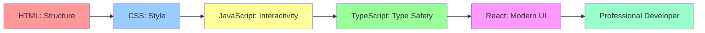

# Complete Course Summary - All 51 Assignments

**By Mahendra Bagul**

This document provides a complete overview of every assignment in the React Learning Path. Use this as your roadmap!

---

## 📊 Course Statistics

| Metric | Value |
|--------|-------|
| **Total Assignments** | 51 Projects |
| **Total Duration** | ~50 weeks (part-time) |
| **Total Hours** | 300-375 hours |
| **Phases** | 5 (HTML → CSS → JS → TS → React) |
| **Skill Level** | Complete Beginner → Professional |
| **Projects Built** | 51 real-world applications |

---

## 📚 Phase Breakdown

<strong>📘 Phase 1: HTML Fundamentals (10 Assignments)</strong>

### Duration: 4-5 weeks | Hours: 35-45

| # | Assignment | Difficulty | Hours | What You'll Build |
|---|------------|------------|-------|-------------------|
| 1 | Hello World | ⭐☆☆☆☆ | 2-3 | First "About Me" webpage |
| 2 | Text Formatting | ⭐⭐☆☆☆ | 2-3 | Learning journal with formatted text |
| 3 | Lists & Links | ⭐⭐☆☆☆ | 3-4 | Multi-page navigation website |
| 4 | Images & Media | ⭐⭐⭐☆☆ | 3-4 | Photo gallery with audio/video |
| 5 | Tables & Data | ⭐⭐⭐☆☆ | 3-4 | Data-rich statistics page |
| 6 | Forms Basics | ⭐⭐⭐⭐☆ | 4-5 | Complete contact/registration form |
| 7 | Semantic HTML | ⭐⭐⭐⭐☆ | 3-4 | Blog layout with semantic structure |
| 8 | HTML5 Features | ⭐⭐⭐⭐☆ | 4-5 | Interactive HTML5 showcase |
| 9 | Accessibility | ⭐⭐⭐⭐⭐ | 4-5 | Fully accessible website |
| 10 | Portfolio Page | ⭐⭐⭐⭐⭐ | 6-8 | Complete HTML portfolio |

**Skills Mastered:**
- HTML document structure
- Semantic markup
- Forms and validation
- Accessibility basics
- HTML5 APIs
- Complete web pages

<strong>🎨 Phase 2: CSS Fundamentals (10 Assignments)</strong>

### Duration: 5-6 weeks | Hours: 40-50

| # | Assignment | Difficulty | Hours | What You'll Build |
|---|------------|------------|-------|-------------------|
| 1 | Selectors Basics | ⭐☆☆☆☆ | 3-4 | Styled business card |
| 2 | Box Model | ⭐⭐☆☆☆ | 3-4 | Box model visualizer |
| 3 | Colors & Typography | ⭐⭐⭐☆☆ | 4-5 | Typography showcase page |
| 4 | Flexbox Basics | ⭐⭐⭐☆☆ | 4-5 | Flexbox photo gallery |
| 5 | CSS Grid | ⭐⭐⭐⭐☆ | 4-5 | Grid-based dashboard |
| 6 | Responsive Design | ⭐⭐⭐⭐☆ | 5-6 | Mobile-first responsive site |
| 7 | Transitions & Animations | ⭐⭐⭐⭐☆ | 4-5 | Animated landing page |
| 8 | Advanced Layouts | ⭐⭐⭐⭐⭐ | 5-6 | Complex multi-section layout |
| 9 | CSS Variables | ⭐⭐⭐⭐⭐ | 4-5 | Theme switcher application |
| 10 | Complete Website | ⭐⭐⭐⭐⭐ | 6-8 | Fully styled business website |

**Skills Mastered:**
- CSS selectors and specificity
- Box model mastery
- Flexbox and Grid
- Responsive design
- Animations and transitions
- CSS custom properties
- Professional styling

<strong>⚡ Phase 3: JavaScript Fundamentals (10 Assignments)</strong>

### Duration: 8-10 weeks | Hours: 50-65

| # | Assignment | Difficulty | Hours | What You'll Build |
|---|------------|------------|-------|-------------------|
| 1 | Basics & Variables | ⭐☆☆☆☆ | 3-4 | Interactive calculator |
| 2 | Functions & Scope | ⭐⭐☆☆☆ | 4-5 | Function playground |
| 3 | Arrays & Objects | ⭐⭐⭐☆☆ | 5-6 | Data manipulation tool |
| 4 | DOM Manipulation | ⭐⭐⭐☆☆ | 5-6 | Dynamic content generator |
| 5 | Event Handling | ⭐⭐⭐☆☆ | 5-6 | Interactive mini-game |
| 6 | ES6 Features | ⭐⭐⭐⭐☆ | 5-6 | ES6 showcase app |
| 7 | Async & Promises | ⭐⭐⭐⭐☆ | 6-7 | Async timer application |
| 8 | Fetch & APIs | ⭐⭐⭐⭐☆ | 6-7 | Weather/news API app |
| 9 | LocalStorage | ⭐⭐⭐⭐⭐ | 6-7 | Note-taking application |
| 10 | Interactive App | ⭐⭐⭐⭐⭐ | 8-10 | Complete JS application |

**Skills Mastered:**
- JavaScript fundamentals
- DOM manipulation
- Event-driven programming
- ES6+ features
- Asynchronous programming
- API integration
- State management basics

<strong>📘 Phase 4: TypeScript Fundamentals (10 Assignments)</strong>

### Duration: 6-7 weeks | Hours: 45-55

| # | Assignment | Difficulty | Hours | What You'll Build |
|---|------------|------------|-------|-------------------|
| 1 | Types Basics | ⭐☆☆☆☆ | 3-4 | Type system explorer |
| 2 | Interfaces & Types | ⭐⭐☆☆☆ | 4-5 | Interface-driven app |
| 3 | Classes & OOP | ⭐⭐⭐☆☆ | 5-6 | Object-oriented application |
| 4 | Generics | ⭐⭐⭐☆☆ | 5-6 | Generic utility library |
| 5 | Advanced Types | ⭐⭐⭐⭐☆ | 5-6 | Advanced type patterns |
| 6 | Modules & Namespaces | ⭐⭐⭐⭐☆ | 4-5 | Modular application |
| 7 | Decorators | ⭐⭐⭐⭐☆ | 5-6 | Decorator pattern app |
| 8 | Type Guards | ⭐⭐⭐⭐⭐ | 5-6 | Type-safe runtime checks |
| 9 | Utility Types | ⭐⭐⭐⭐⭐ | 4-5 | Utility type showcase |
| 10 | TypeScript Project | ⭐⭐⭐⭐⭐ | 6-8 | Complete TS application |

**Skills Mastered:**
- TypeScript type system
- Interfaces and type aliases
- Object-oriented TypeScript
- Generics and advanced types
- Type guards and assertions
- Professional TypeScript development

<strong>⚛️ Phase 5: React Mastery (11 Assignments)</strong>

### Duration: 23 weeks | Hours: 130-160

#### Standalone Projects (Assignments 1-5)

| # | Assignment | Difficulty | Hours | What You'll Build |
|---|------------|------------|-------|-------------------|
| 1 | Personal Portfolio | ⭐⭐☆☆☆ | 8-10 | React portfolio with routing |
| 2 | Weather Dashboard | ⭐⭐⭐☆☆ | 10-12 | Weather app with API |
| 3 | Task Manager | ⭐⭐⭐⭐☆ | 12-15 | MUI-based task app |
| 4 | E-Commerce Catalog | ⭐⭐⭐⭐⭐ | 15-18 | Redux shopping app |
| 5 | Movie Explorer | ⭐⭐⭐⭐⭐ | 18-20 | Advanced React patterns |

#### ConnectHub Social Media App (Assignments 6-10)

| # | Assignment | Difficulty | Hours | What You'll Build |
|---|------------|------------|-------|-------------------|
| 6 | Authentication & Setup | ⭐⭐⭐⭐☆ | 10-12 | Firebase auth, TypeScript setup |
| 7 | Posts & Dashboard | ⭐⭐⭐⭐⭐ | 12-15 | CRUD, Charts, Analytics |
| 8 | Social Features | ⭐⭐⭐⭐⭐ | 12-15 | Comments, Follows, Notifications |
| 9 | Real-time Chat | ⭐⭐⭐⭐⭐ | 12-15 | Socket.io chat, Online status |
| 10 | Testing & Deployment | ⭐⭐⭐⭐⭐ | 12-15 | Testing, CI/CD, Production |

#### Bonus

| # | Assignment | Difficulty | Hours | What You'll Build |
|---|------------|------------|-------|-------------------|
| 11 | Performance Optimization | ⚡⚡⚡⚡⚡ | 10-15 | Performance dashboard, optimization techniques |

**Skills Mastered:**
- React 18+ fundamentals
- Hooks and custom hooks
- React Router v6
- Context API and Redux
- Material-UI and Tailwind
- Firebase integration
- Real-time features
- Testing and deployment
- Performance optimization

---

## 🎯 Learning Progression

---

## 📈 Difficulty Curve

| Phase | Start Level | End Level |
|-------|-------------|-----------|
| **HTML** | Complete Beginner | Basic Web Developer |
| **CSS** | Basic | Intermediate Styling |
| **JavaScript** | Beginner Programming | Intermediate Developer |
| **TypeScript** | Intermediate JS | Advanced Developer |
| **React** | Advanced Concepts | Professional React Dev |

---

## 🎓 What You'll Have Completed

### Portfolio
- ✅ 51 complete projects with source code
- ✅ Live deployed demonstrations
- ✅ Professional GitHub portfolio
- ✅ Documentation for each project

### Technical Skills
- ✅ **HTML5** - Semantic, accessible markup
- ✅ **CSS3** - Modern layouts, animations, responsive design
- ✅ **JavaScript ES6+** - Async, APIs, modern syntax
- ✅ **TypeScript** - Type-safe applications
- ✅ **React 18+** - Components, hooks, state management
- ✅ **Redux Toolkit** - Global state management
- ✅ **Material-UI & Tailwind** - UI libraries
- ✅ **Firebase** - Authentication, database, hosting
- ✅ **Testing** - Jest, React Testing Library, Cypress
- ✅ **Deployment** - Netlify, Vercel, CI/CD

### Professional Skills
- ✅ Problem-solving and debugging
- ✅ Code organization and architecture
- ✅ Version control with Git
- ✅ Best practices and patterns
- ✅ Performance optimization
- ✅ Accessibility considerations
- ✅ Documentation writing
- ✅ Self-directed learning

---

## ⏱️ Time Commitment Estimates

### Part-Time (6-8 hours/week)
- **Total Duration**: ~60 weeks (15 months)
- **Good for**: Working professionals, students
- **Schedule**: 1 hour/day + weekends

### Committed (10-15 hours/week)
- **Total Duration**: ~50 weeks (12 months)
- **Good for**: Serious learners, career switchers
- **Schedule**: 2 hours/day + weekends

### Intensive (20-30 hours/week)
- **Total Duration**: ~30 weeks (7 months)
- **Good for**: Bootcamp-style, full-time learning
- **Schedule**: 3-4 hours/day + weekends

---

## ✅ Success Criteria

You've successfully completed this course when you can:

### Technical Competency
- [ ] Write semantic HTML from scratch
- [ ] Create responsive, beautiful CSS layouts
- [ ] Build interactive applications with JavaScript
- [ ] Develop type-safe code with TypeScript
- [ ] Create professional React applications
- [ ] Integrate APIs and handle async operations
- [ ] Implement authentication and authorization
- [ ] Write tests for your applications
- [ ] Deploy applications to production
- [ ] Optimize for performance

### Practical Skills
- [ ] Debug errors independently
- [ ] Read and understand documentation
- [ ] Search for solutions effectively
- [ ] Explain technical concepts clearly
- [ ] Review and improve code quality
- [ ] Plan and architect applications
- [ ] Manage project complexity
- [ ] Learn new technologies quickly

---

## 🚀 Career Readiness

After completing this course, you'll be ready for:

### Junior Frontend Developer
- HTML, CSS, JavaScript foundations
- React experience
- Portfolio of projects

### React Developer
- React expertise
- State management
- Testing and deployment

### Full Stack (with backend learning)
- Frontend mastery complete
- Ready to learn Node.js, databases
- API integration experience

---

## 📚 Phase-by-Phase Goals

### After Phase 1 (HTML)
✅ Build basic static websites  
✅ Understand web structure  
✅ Create accessible markup

### After Phase 2 (CSS)
✅ Create beautiful, responsive designs  
✅ Master modern layouts  
✅ Build professional-looking sites

### After Phase 3 (JavaScript)
✅ Add interactivity to websites  
✅ Consume APIs  
✅ Build dynamic applications

### After Phase 4 (TypeScript)
✅ Write type-safe code  
✅ Better IDE support  
✅ Catch errors before runtime

### After Phase 5 (React)
✅ Build modern single-page applications  
✅ Manage complex state  
✅ Create professional-grade projects  
✅ Ready for employment!

---

## 🔗 Quick Navigation

### Getting Started
- [Main README](./README.md)
- [Get Started Here](./GET_STARTED_HERE.md)
- [Quick Start Guide](./QUICK_START.md)

### Phases
- [Phase 1: HTML](./01-html-fundamentals/)
- [Phase 2: CSS](./02-css-fundamentals/)
- [Phase 3: JavaScript](./03-javascript-fundamentals/)
- [Phase 4: TypeScript](./04-typescript-fundamentals/)
- [Phase 5: React](./05-react-course/)

### Resources
- [FAQ & Troubleshooting](./resources/FAQ_AND_TROUBLESHOOTING.md)
- [Common Patterns](./resources/COMMON_PATTERNS.md)
- [Learning Tracker](./notes/LEARNING_TRACKER.md)

---

## 💡 Tips for Success

1. **Follow the order** - Assignments build on each other
2. **Complete everything** - Don't skip assignments
3. **Type code yourself** - No copy-paste learning
4. **Experiment freely** - Try things beyond requirements
5. **Build side projects** - Apply skills to your own ideas
6. **Join communities** - Learn with others
7. **Track progress** - Use the learning tracker
8. **Take breaks** - Rest is part of learning
9. **Celebrate milestones** - Acknowledge your progress
10. **Stay consistent** - Daily practice > weekend marathons

---

## 🎉 You've Got This!

This is a comprehensive journey from complete beginner to professional React developer. It's challenging, rewarding, and absolutely achievable.

Thousands of developers started exactly where you are. The only difference? They started and didn't stop.

**Your turn! Let's build something amazing!** 🚀

---

**Created by**: [Mahendra Bagul](https://github.com/bagulm123)  
**Full Stack Polyglot Programmer**

**Connect:**
- 🐙 [GitHub](https://github.com/bagulm123)
- 💼 [LinkedIn](https://linkedin.com/in/bagulm123)
- 🐦 [X/Twitter](https://x.com/bagulm123)

---

**Ready to start?** → [Get Started Here](./GET_STARTED_HERE.md)

**Have questions?** → [FAQ](./resources/FAQ_AND_TROUBLESHOOTING.md)

