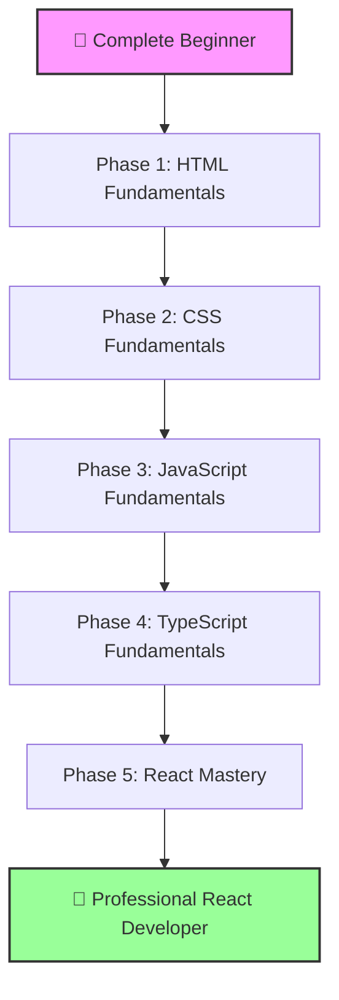

# Complete React Learning Path 🚀

**From Zero to React Hero - A Complete Beginner's Journey**

**Created by**: [Mahendra Bagul](https://github.com/bagulm123)  
Full Stack Polyglot Programmer

---

## 👋 Welcome!

Hey there! I'm Mahendra, and I've been exactly where you are right now.

If you're a complete beginner who's never written a line of code, **you're in the right place**. This course starts from absolute zero - no experience required!

I created this learning path because I remember struggling to find resources that truly started from the beginning. Most courses assume you know things, skip steps, or jump too quickly into complex topics. This one doesn't.

We'll start by creating your very first webpage with HTML, gradually build up your skills through CSS and JavaScript, master TypeScript, and finally dive deep into React to build modern, professional applications.

**This is the resource I wish I had when I started.** 🎯

---

## 📊 Course Overview

### 📈 Learning Statistics

| Phase | Assignments | Duration | Hours | Skill Level |
|-------|-------------|----------|-------|-------------|
| **1. HTML** | 10 | 4-5 weeks | 35-45 | Beginner |
| **2. CSS** | 10 | 5-6 weeks | 40-50 | Beginner → Intermediate |
| **3. JavaScript** | 10 | 8-10 weeks | 50-65 | Intermediate |
| **4. TypeScript** | 10 | 6-7 weeks | 45-55 | Intermediate → Advanced |
| **5. React** | 11 | 23 weeks | 130-160 | Advanced → Expert |
| **TOTAL** | **51** | **~50 weeks** | **300-375 hours** | **Zero → Professional** |

---

## 🎯 What You'll Build

By the end of this course, you'll have built 51 real projects including:

### Phase 1: HTML Projects (10)
- 📝 Personal About Me Page
- 📰 Formatted Blog Post
- 🔗 Multi-page Website with Navigation
- 🖼️ Photo Gallery
- 📊 Data Tables
- 📋 Contact Forms
- 🏗️ Semantic Blog Layout
- 🎨 HTML5 Interactive Features
- ♿ Accessible Website
- 💼 Complete HTML Portfolio

### Phase 2: CSS Projects (10)
- 🎨 Styled Business Card
- 📦 Box Model Visualizer
- 🎭 Typography Showcase
- 📱 Flexbox Photo Gallery
- 🏗️ CSS Grid Dashboard
- 📱 Responsive Website
- ✨ Animated Landing Page
- 🎯 Advanced Layout Challenges
- 🌈 CSS Variables Theme Switcher
- 🌐 Complete Styled Website

### Phase 3: JavaScript Projects (10)
- 🧮 Calculator App
- 🎯 Interactive Quiz
- 📝 Dynamic Todo List
- 🎨 DOM Manipulation Playground
- 🎮 Event-driven Mini Game
- 📦 ES6 Feature Showcase
- ⏰ Async/Await Timer App
- 🌤️ Weather API Consumer
- 💾 LocalStorage Note App
- 🎯 Interactive Web Application

### Phase 4: TypeScript Projects (10)
- 📘 Type System Explorer
- 🏗️ Interface-driven Design
- 🎭 Class-based Application
- 🔧 Generic Utilities
- 🎯 Advanced Type Challenges
- 📦 Module System Project
- ✨ Decorator Pattern Implementation
- 🛡️ Type Guard Showcase
- 🔨 Utility Types Project
- 🚀 Full TypeScript Application

### Phase 5: React Projects (11)
- 💼 Personal Portfolio (React)
- 🌦️ Weather Dashboard
- ✅ Task Manager with MUI
- 🛒 E-Commerce Catalog (Redux)
- 🎬 Movie Explorer (Advanced)
- 🔐 ConnectHub - Authentication
- 📱 ConnectHub - Dashboard
- 👥 ConnectHub - Social Features
- 💬 ConnectHub - Real-time Chat
- 🧪 ConnectHub - Testing & Deploy
- ⚡ Performance Optimization (Bonus)

---

## 🗺️ Detailed Learning Roadmap

<strong>📘 Phase 1: HTML Fundamentals (4-5 weeks)</strong>

### What You'll Master
- HTML document structure
- Text formatting and semantics
- Lists and navigation
- Images and multimedia
- Tables and data
- Forms and validation
- Semantic HTML5 elements
- Accessibility basics
- Complete web pages

### Assignments
1. ⭐☆☆☆☆ Hello World
2. ⭐⭐☆☆☆ Text Formatting
3. ⭐⭐☆☆☆ Lists & Links
4. ⭐⭐⭐☆☆ Images & Media
5. ⭐⭐⭐☆☆ Tables & Data
6. ⭐⭐⭐⭐☆ Forms Basics
7. ⭐⭐⭐⭐☆ Semantic HTML
8. ⭐⭐⭐⭐☆ HTML5 Features
9. ⭐⭐⭐⭐⭐ Accessibility
10. ⭐⭐⭐⭐⭐ Portfolio Page

[Start Phase 1 →](./01-html-fundamentals/)

<strong>🎨 Phase 2: CSS Fundamentals (5-6 weeks)</strong>

### What You'll Master
- CSS selectors and specificity
- Box model mastery
- Colors, typography, fonts
- Flexbox layouts
- CSS Grid systems
- Responsive design
- Transitions and animations
- Advanced layouts
- CSS variables and themes
- Complete styled websites

### Assignments
1. ⭐☆☆☆☆ Selectors Basics
2. ⭐⭐☆☆☆ Box Model
3. ⭐⭐⭐☆☆ Colors & Typography
4. ⭐⭐⭐☆☆ Flexbox Basics
5. ⭐⭐⭐⭐☆ CSS Grid
6. ⭐⭐⭐⭐☆ Responsive Design
7. ⭐⭐⭐⭐☆ Transitions & Animations
8. ⭐⭐⭐⭐⭐ Advanced Layouts
9. ⭐⭐⭐⭐⭐ CSS Variables
10. ⭐⭐⭐⭐⭐ Complete Website

[Start Phase 2 →](./02-css-fundamentals/)

<strong>⚡ Phase 3: JavaScript Fundamentals (8-10 weeks)</strong>

### What You'll Master
- Variables, data types, operators
- Functions and scope
- Arrays and objects
- DOM manipulation
- Event handling
- ES6+ features (arrow functions, destructuring, spread)
- Async programming (Promises, async/await)
- Fetch API and AJAX
- LocalStorage and state
- Interactive applications

### Assignments
1. ⭐☆☆☆☆ Basics & Variables
2. ⭐⭐☆☆☆ Functions & Scope
3. ⭐⭐⭐☆☆ Arrays & Objects
4. ⭐⭐⭐☆☆ DOM Manipulation
5. ⭐⭐⭐☆☆ Event Handling
6. ⭐⭐⭐⭐☆ ES6 Features
7. ⭐⭐⭐⭐☆ Async & Promises
8. ⭐⭐⭐⭐☆ Fetch & APIs
9. ⭐⭐⭐⭐⭐ LocalStorage
10. ⭐⭐⭐⭐⭐ Interactive App

[Start Phase 3 →](./03-javascript-fundamentals/)

<strong>📘 Phase 4: TypeScript Fundamentals (6-7 weeks)</strong>

### What You'll Master
- TypeScript basics and types
- Interfaces and type aliases
- Classes and OOP
- Generics
- Advanced types (Union, Intersection, Conditional)
- Modules and namespaces
- Decorators
- Type guards and assertions
- Utility types
- TypeScript projects

### Assignments
1. ⭐☆☆☆☆ Types Basics
2. ⭐⭐☆☆☆ Interfaces & Types
3. ⭐⭐⭐☆☆ Classes & OOP
4. ⭐⭐⭐☆☆ Generics
5. ⭐⭐⭐⭐☆ Advanced Types
6. ⭐⭐⭐⭐☆ Modules & Namespaces
7. ⭐⭐⭐⭐☆ Decorators
8. ⭐⭐⭐⭐⭐ Type Guards
9. ⭐⭐⭐⭐⭐ Utility Types
10. ⭐⭐⭐⭐⭐ TypeScript Project

[Start Phase 4 →](./04-typescript-fundamentals/)

<strong>⚛️ Phase 5: React Mastery (23 weeks)</strong>

### What You'll Master
- React components and JSX
- State and props
- Hooks (useState, useEffect, custom hooks)
- React Router
- Context API
- Redux Toolkit
- Material-UI and Tailwind
- API integration
- Authentication (Firebase)
- Real-time features (Socket.io)
- Testing (Jest, React Testing Library, Cypress)
- Performance optimization
- Deployment

### Assignments

**Standalone Projects (1-5)**
1. ⭐⭐☆☆☆ Personal Portfolio
2. ⭐⭐⭐☆☆ Weather Dashboard
3. ⭐⭐⭐⭐☆ Task Manager (MUI)
4. ⭐⭐⭐⭐⭐ E-Commerce (Redux)
5. ⭐⭐⭐⭐⭐ Movie Explorer

**ConnectHub App (6-10)**

6. ⭐⭐⭐⭐☆ Authentication & Setup

7. ⭐⭐⭐⭐⭐ Posts & Dashboard

8. ⭐⭐⭐⭐⭐ Social Features

9. ⭐⭐⭐⭐⭐ Real-time Chat

10. ⭐⭐⭐⭐⭐ Testing & Deployment

**Bonus**
11. ⚡⚡⚡⚡⚡ Performance Optimization

[Start Phase 5 →](./05-react-course/)

---

## 🚀 Getting Started

### Step 1: Read This First!

**For Complete Beginners**: Start here → [`GET_STARTED_HERE.md`](./GET_STARTED_HERE.md)

This guide will:
- Help you set up your computer
- Install necessary software
- Understand how the course works
- Create your first file

### Step 2: Understand the Structure

Read [`COURSE_SUMMARY.md`](./COURSE_SUMMARY.md) for a complete overview of all 51 assignments.

### Step 3: Start Learning!

Begin with **Phase 1, Assignment 1**: [HTML Fundamentals - Hello World](./01-html-fundamentals/assignment-01-hello-world/ASSIGNMENT_1_GUIDE.md)

---

## 💻 What You Need

### Required Software (All Free!)
- **Web Browser** - Chrome, Firefox, or Edge
- **Text Editor** - VS Code (recommended) or any text editor
- **Git** - For version control
- **Node.js** - For JavaScript/React assignments

### Setup Guide
See [`QUICK_START.md`](./QUICK_START.md) for detailed installation instructions.

---

## 📚 Course Materials

### 📖 Main Guides
- **README.md** (You are here!) - Course overview
- **GET_STARTED_HERE.md** - Onboarding for complete beginners
- **COURSE_SUMMARY.md** - Detailed breakdown of all assignments
- **QUICK_START.md** - Software setup guide
- **FOLDER_STRUCTURE.md** - How to navigate the course
- **CREDITS.md** - About the author and course philosophy

### 📁 Phase Structure
Each phase (HTML, CSS, JavaScript, TypeScript, React) includes:
- Phase README with overview
- 10 assignments (11 for React) with detailed guides
- UI mockups for visual reference
- Example code and solutions
- Common mistakes and troubleshooting

### 🎓 For Instructors/Mentors
- **for-instructors/** - Teaching guides and grading rubrics

### 📚 Resources
- **resources/** - Common patterns, FAQs, API guides
- **deployment-configs/** - Deployment guides for various platforms
- **common-components/** - Reusable code snippets

---

## ✅ Progress Tracking

Use the built-in [`notes/LEARNING_TRACKER.md`](./notes/LEARNING_TRACKER.md) to:
- Track completed assignments
- Note challenges faced
- Document solutions found
- Set weekly goals
- Celebrate milestones!

---

## 🎯 Learning Philosophy

### How This Course Works

**1. Learn by Doing**
Every assignment is a real project. You'll build actual websites and applications, not just follow tutorials.

**2. Progressive Difficulty**
Start simple, gradually increase complexity. Each assignment builds on previous ones.

**3. Real-World Focus**
Learn what you'll actually use in professional development, not just theory.

**4. Best Practices from Day One**
Learn the right way from the start - semantic HTML, clean code, accessibility.

**5. Comprehensive Documentation**
Every concept explained clearly, assuming zero prior knowledge.

### How to Succeed

- ✅ **Do assignments in order** - They build on each other
- ✅ **Type code yourself** - Don't just copy-paste
- ✅ **Experiment** - Try things beyond requirements
- ✅ **Take breaks** - Learning happens during rest too
- ✅ **Build real projects** - Apply skills to your own ideas
- ✅ **Join communities** - Learn with others
- ✅ **Be patient** - Everyone learns at their own pace

---

## 📊 What You'll Have at the End

### Portfolio Projects
- ✅ 51 complete projects with live demos
- ✅ Production-ready code
- ✅ Professional GitHub portfolio
- ✅ Deployed applications

### Technical Skills
- ✅ HTML5 & Semantic Markup
- ✅ Modern CSS (Flexbox, Grid, Animations)
- ✅ JavaScript ES6+
- ✅ TypeScript
- ✅ React 18+
- ✅ State Management (Context, Redux)
- ✅ Testing & Deployment
- ✅ Performance Optimization

### Soft Skills
- ✅ Problem-solving
- ✅ Debugging
- ✅ Code organization
- ✅ Self-learning ability
- ✅ Project management
- ✅ Best practices

---

## 🌟 Success Stories

> "This is the first course that truly started from zero. Within 3 months, I built my first React app!" - *Student*

> "The progressive structure made complex topics feel manageable. Highly recommend!" - *Career Changer*

> "As an instructor, these materials saved me hundreds of hours. The quality is outstanding." - *Educator*

---

## 🆘 Getting Help

### Stuck on Something?
1. **Re-read the assignment guide** - Often the answer is there
2. **Check UI mockups** - Visual references help
3. **Review example code** - See working solutions
4. **Read Common Mistakes** - Most issues are documented
5. **Check the FAQ** - [`resources/FAQ_AND_TROUBLESHOOTING.md`](./resources/FAQ_AND_TROUBLESHOOTING.md)

### Learning Resources
- 📖 [MDN Web Docs](https://developer.mozilla.org/) - Best web dev documentation
- 🎥 [freeCodeCamp](https://www.freecodecamp.org/) - Free courses
- 💬 [Stack Overflow](https://stackoverflow.com/) - Q&A community
- 🎓 [React Docs](https://react.dev/) - Official React documentation

---

## 🤝 Contributing

Found a typo? Have a suggestion? Want to add more assignments?

This course is a living resource! Contributions are welcome.

---

## 📜 License

This course is free and open for educational use. Feel free to:
- ✅ Learn from it
- ✅ Share it with others
- ✅ Use it for teaching
- ✅ Build upon it

Just give credit where it's due! 😊

---

## 🙏 Acknowledgments

This course exists because I struggled, learned, and wanted to make the path easier for others.

Special thanks to:
- The amazing web dev community
- MDN for incredible documentation
- Everyone who believed in accessible education
- YOU for choosing to learn!

---

## 📮 Connect With Me

- **GitHub**: [@bagulm123](https://github.com/bagulm123)
- **LinkedIn**: [bagulm123](https://linkedin.com/in/bagulm123)
- **X (Twitter)**: [@bagulm123](https://x.com/bagulm123)

I'd love to see what you build! Tag me in your projects! 🚀

---

## 🎉 Ready to Start Your Journey?

Remember: **Every expert was once a beginner.**

The difference is they started, stayed consistent, and never stopped learning.

You've got this! 💪

### Your Next Steps:
1. Read [`GET_STARTED_HERE.md`](./GET_STARTED_HERE.md)
2. Set up your environment with [`QUICK_START.md`](./QUICK_START.md)
3. Start [Assignment 1](./01-html-fundamentals/assignment-01-hello-world/ASSIGNMENT_1_GUIDE.md)

---

**Let's build something amazing together!** 🚀

---

**Created with ❤️ by [Mahendra Bagul](https://github.com/bagulm123)**

*Full Stack Polyglot Programmer*

⭐ Star this repo if you find it helpful!  
🔗 Share it with aspiring developers!  
💬 Let me know how your learning journey goes!

